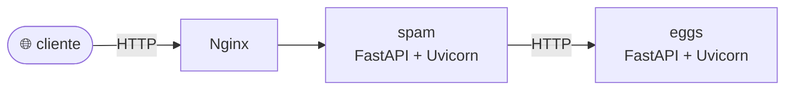
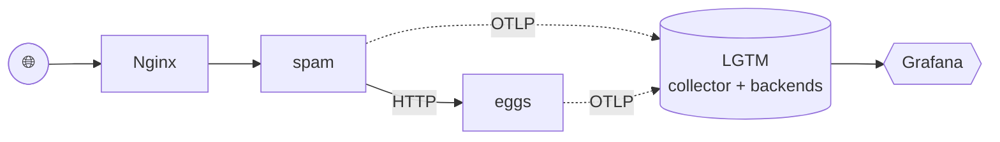

# Estudos de Observabilidade em Python

> Jornada incremental pelo ecossistema de observabilidade moderno em Python: **telemetria, OpenTelemetry, Prometheus, Tempo, Loki, Grafana e Logfire**. Cada aula é uma pasta independente, com apostila autoral e código funcional — do serviço "cego" ao stack de observabilidade completo.

## Por que esse repositório existe

Observabilidade é uma dessas áreas em que o vocabulário importa tanto quanto a ferramenta. Esse repositório documenta o meu estudo do tema partindo de uma aplicação Python propositalmente **sem instrumentação** e adicionando, aula por aula, cada pilar da observabilidade. A ideia é que qualquer pessoa possa:

- Clonar, rodar, e entender a motivação de cada peça.
- Ver a **evolução do código** (commits progressivos) e a **evolução do raciocínio** (apostilas).
- Usar como referência futura quando precisar instrumentar algo próprio.

## Índice das aulas

| # | Tema | Pasta | Status |
|---|------|-------|--------|
| 1 | Introdução à observabilidade (teoria + aplicação base) | [`projeto_1-introducao/`](./projeto_1-introducao/) | ✅ concluída |
| 2 | Métricas com OpenTelemetry e Prometheus (LGTM) | [`projeto_2-metricas/`](./projeto_2-metricas/) | ✅ concluída |
| 3 | Tracing com OpenTelemetry, Tempo e Jaeger | `projeto_3-tracing/` | 🔜 em breve |
| 4 | Logs com OpenTelemetry e Loki | `projeto_4-logs/` | 🔜 em breve |
| 5 | Logfire como alternativa gerenciada | `projeto_5-logfire/` | 🔜 em breve |

Cada pasta contém seu próprio `README.md` (como rodar, o que faz, o que foi adicionado em relação à aula anterior) e uma `apostila_aula_NN.md` (o conteúdo teórico digerido em formato didático).

## Arquitetura-base

Todas as aulas evoluem o mesmo cenário de referência: dois microsserviços Python atrás de um reverse proxy, com o `spam` dependendo do `eggs`.

A partir da aula 2, o cenário ganha um backend de observabilidade (`grafana/otel-lgtm` — Collector + Prometheus + Tempo + Loki + Grafana em um único container) recebendo telemetria via OTLP:

## Stack técnica

- **Linguagem:** Python 3.12
- **Framework web:** FastAPI (ASGI)
- **Servidor de aplicação:** Uvicorn
- **Cliente HTTP:** httpx (async)
- **Validação:** Pydantic v2
- **Reverse proxy:** Nginx
- **Containerização:** Docker + docker-compose
- **Observabilidade:** OpenTelemetry, Prometheus (Mimir), Tempo, Loki, Grafana, Logfire

## Pré-requisitos

- [Python 3.12+](https://www.python.org/)
- [Docker](https://docs.docker.com/get-docker/) com docker-compose (recomendado a partir da aula 2)
- Opcional: [Git](https://git-scm.com/) para acompanhar os diffs entre aulas

## Como navegar

Cada aula funciona de forma **autônoma**. Entre na pasta da aula que te interessa, leia o README local, e siga as instruções. Se quiser o caminho mais didático:

1. Comece pela [aula 1](./projeto_1-introducao/) — apostila conceitual + aplicação base sem instrumentação.
2. [Aula 2](./projeto_2-metricas/) — adiciona métricas (manual no spam, automática no eggs) e o backend LGTM.
3. Avance aula por aula observando o que foi adicionado em cada uma.

## Créditos

Conteúdo inspirado em:

- Série **"Observabilidade"** do Eduardo Mendes ([@dunossauro](https://github.com/dunossauro)) — [Live de Python #261](https://www.youtube.com/watch?v=9mifCIFhtIQ), [#263](https://www.youtube.com/watch?v=GvF8hlqaR-c) e seguintes.
- Repositório-referência do Dunossauro: [live-de-python/codigo](https://github.com/dunossauro/live-de-python/tree/main/codigo).
- Livro **Observability Engineering** (Majors, Fong-Jones, Miranda — O'Reilly).
- Projeto **OpenTelemetry** e sua documentação: <https://opentelemetry.io/>.

As apostilas e o código desse repositório são reinterpretações e extensões autorais, usadas como material de estudo e portfólio pessoal.

## Licença

MIT — sinta-se à vontade para usar, adaptar e aprender.
