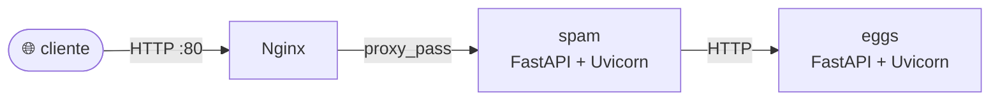

# Aula 1 — Introdução à Observabilidade

> Primeiro módulo de uma série de estudos sobre **observabilidade em aplicações Python**, construída a partir da [Live de Python #261](https://www.youtube.com/watch?v=9mifCIFhtIQ) do Eduardo Mendes (Dunossauro) e material complementar.

## O que essa aula cobre

A aula 1 é **conceitual**. O objetivo é construir o vocabulário e montar o cenário de base que será instrumentado nas aulas seguintes. Não há observabilidade aqui — é proposital. Começamos "cegos", como a maioria das aplicações começa, e vamos plugando sensores aula por aula.

- **Teoria:** veja [`apostila_aula_01.md`](./apostila_aula_01.md).
- **Prática:** essa pasta — uma aplicação em microsserviços (`spam` + `eggs`) atrás de um Nginx, totalmente sem instrumentação.

## Arquitetura



- **`spam`** é o serviço voltado para fora. Recebe as requisições que chegam pelo Nginx e, quando precisa de dados, chama o `eggs`.
- **`eggs`** é o serviço interno. Não é exposto ao mundo — só o `spam` fala com ele (em produção; aqui deixamos uma porta mapeada para debug).
- **`nginx`** é o reverse proxy — porta de entrada, balanceador futuro e candidato a gerar métricas de camada HTTP.

## Como rodar

### Opção 1: Docker (recomendado, reproduz o cenário completo)

```bash
docker compose up --build
```

- Cliente externo: <http://localhost> (passa pelo Nginx → spam)
- Spam direto (debug): <http://localhost:8000/docs>
- Eggs direto (debug): <http://localhost:8001/docs>

### Opção 2: Local, sem Docker (iteração rápida)

Útil se você está num Windows sem Docker, ou só quer testar os endpoints isoladamente usando a sua `.obsvenv`.

```powershell
# Ative sua venv
.\.obsvenv\Scripts\Activate.ps1

# Instale as dependências unificadas
pip install -r requirements.txt

# Terminal 1: eggs na porta 8001
cd eggs
$env:SERVICE_NAME="eggs"
uvicorn app.main:app --host 0.0.0.0 --port 8001

# Terminal 2: spam na porta 8000
cd spam
$env:SERVICE_NAME="spam"
$env:EGGS_URL="http://localhost:8001"
uvicorn app.main:app --host 0.0.0.0 --port 8000
```

Sem Nginx nessa opção — você bate direto no spam.

## Endpoints para experimentar

### spam (porta 8000)

| Método | Rota | O que faz |
|--------|------|-----------|
| `GET` | `/` | Status simples do serviço |
| `GET` | `/health` | Healthcheck |
| `GET` | `/saudacao/{nome}` | Saudação local, sem I/O externo |
| `GET` | `/combo/{nome}` | Saudação + dado pedido ao `eggs` (cross-service) |
| `GET` | `/tarefa/{n}` | Faz N chamadas sequenciais ao `/processamento` do `eggs` |
| `GET` | `/eco?mensagem=...` | Echo trivial — bom para testes de carga |

### eggs (porta 8001 no Docker, ou 8001 local)

| Método | Rota | O que faz |
|--------|------|-----------|
| `GET` | `/` | Status simples |
| `GET` | `/health` | Healthcheck |
| `GET` | `/dados/aleatorio` | Inteiro aleatório |
| `GET` | `/processamento` | Espera 50-250ms (latência variável) |
| `GET` | `/fibonacci/{n}` | Fibonacci recursivo ingênuo (0 ≤ n ≤ 35) |

### Sugestões de requisições

```bash
# Fluxo cliente -> nginx -> spam -> eggs
curl http://localhost/combo/pedro

# Stress controlado para observar latência acumulada
curl http://localhost/tarefa/5

# Endpoint "problemático" — vai ficar lento para n grande
curl http://localhost:8001/fibonacci/30
```

## O que intencionalmente **não** está aqui

- Nenhum `opentelemetry-*` no `requirements.txt`.
- Nenhum sensor de métrica, nenhum trace, nenhum log estruturado.
- Apenas os prints automáticos do Uvicorn/Nginx.

Esse é o **estado "cego"** do sistema. Quando você rodar, vai perceber que as perguntas da apostila (quantas requisições? quão lento? onde falha?) são impossíveis de responder olhando só o terminal. É aí que a aula 2 entra.

## Próximo passo

Aula 2 — **Métricas com OpenTelemetry e Prometheus**. A gente adiciona o primeiro sinal.

## Créditos

- Conteúdo base: Eduardo Mendes ([@dunossauro](https://github.com/dunossauro)) — Live de Python #261.
- Repositório original: <https://github.com/dunossauro/live-de-python/tree/main/codigo/Live261>
- Reinterpretação didática e implementação desse projeto: estudo pessoal.
