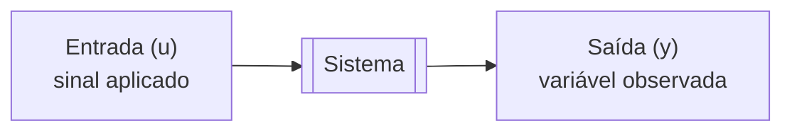
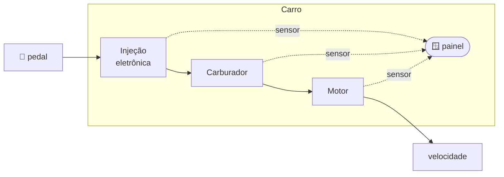
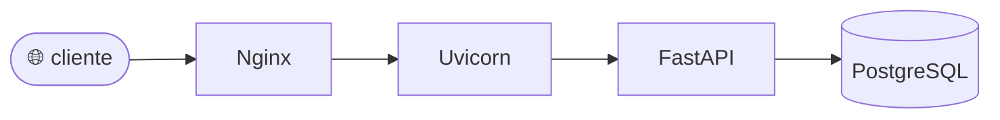
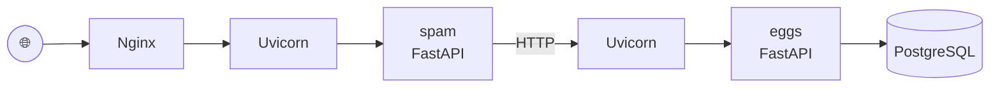
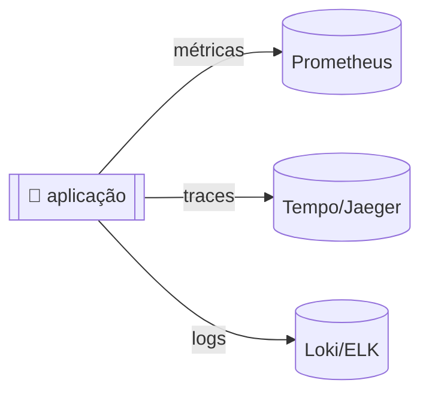
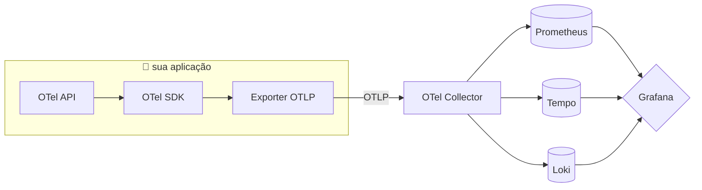

# Aula 1 — Introdução à Observabilidade

> Apostila construída a partir da **Live de Python #261 — "Introdução a observabilidade com OpenTelemetry"**, do Eduardo Mendes (Dunossauro). Créditos e link do material original no README do repositório. O que você lê aqui é uma reinterpretação didática, escrita como se eu estivesse te explicando pessoalmente. Serve tanto para consulta rápida quanto para estudo denso.

---

## 1. Por onde vamos passar

Antes de começar, quero ser honesto com você: **essa aula 1 é quase toda conceitual**. A gente quase não escreve código de observabilidade aqui. Isso pode parecer estranho para quem gosta de colocar a mão na massa rápido, mas tem um motivo forte: observabilidade é uma dessas áreas onde, se você não tem o vocabulário certo, cada nova ferramenta parece mágica ou complexidade inútil. Quando você entende os conceitos, as ferramentas viram só implementações diferentes das mesmas ideias — e você escolhe o que te serve em vez de acumular buzzwords.

O roteiro dessa aula é:

1. **Um passo atrás.** Vamos olhar para uma ideia de 1960 (teoria de controle) que é a raiz de tudo que discutimos hoje.
2. **Trazendo para o nosso mundo.** Como esses conceitos aparecem em uma aplicação Python real — servidor web, servidor de aplicação, framework, banco.
3. **Telemetria.** O "como" — a arte de fazer o sistema emitir sinais sobre ele mesmo enquanto está rodando.
4. **Observabilidade.** O "para quê" — usar esses sinais para responder perguntas que você nem sabia que ia ter que responder.

No fim, você vai entender **por que** o OpenTelemetry existe e **qual problema** ele resolve. As próximas aulas (métricas, tracing, logs, logfire) vão preencher os "comos" específicos.

---

## 2. Um passo atrás: teoria de controle

Em 1960, o matemático Rudolf Kalman formalizou uma ideia que parece óbvia quando você ouve, mas que foi revolucionária: **um sistema pode ser descrito em termos de entradas, saídas, e uma relação entre elas**. Se eu sei o que entra, e sei o que sai, eu posso começar a fazer afirmações sobre o que está acontecendo *dentro* — mesmo sem abrir a caixa.



O exemplo clássico é um carro. A entrada é o quanto você aperta o acelerador. A saída é a velocidade que você lê no painel. Entre uma coisa e outra existe um sistema — motor, injeção, carburador, transmissão. Se você só olha a relação "apertei o pedal → velocidade subiu", você consegue dirigir o carro, mas não consegue diagnosticar nada. Se o carro está lento, é o motor? É a injeção? É o combustível ruim? Você não sabe.

É aqui que entra o conceito que importa pra gente: **abrir a caixa preta**. Em vez de olhar só entrada e saída global, eu coloco **sensores** em pontos internos do sistema:



Agora eu não olho só "quanto de pedal entrou e quanta velocidade saiu" — eu olho o que está acontecendo em cada etapa intermediária. Isso muda o jogo: agora eu consigo **raciocinar sobre causas**, não só sobre sintomas.

> 💡 **Guarde essa ideia.** Observar um sistema não é só medir o resultado final. É instrumentar os componentes internos pra você poder explicar *por que* o resultado final foi aquele.

Os instrumentos do painel do carro (velocímetro, conta-giros, indicador de combustível, temperatura do motor) são basicamente uma UI para os dados dos sensores. É exatamente o análogo do que a gente vai construir pra software: sensores na aplicação + um painel (dashboard) pra ler os sinais.

---

## 3. Trazendo isso pro nosso mundo: aplicações Python

Quando você cria uma aplicação web moderna, você toma uma sequência de decisões que, juntas, formam uma pilha:

- **Linguagem**: Python (a nossa escolha)
- **Framework**: Flask, Django, FastAPI, Litestar, Sanic, …
- **Servidor de aplicação (WSGI/ASGI)**: Gunicorn, Uvicorn, Hypercorn, …
- **Servidor web (reverse proxy)**: Nginx, Traefik, Caddy, …
- **Banco de dados**: PostgreSQL, MySQL, MongoDB, …
- **Containerização**: Docker, Podman, k8s, …
- **Deploy**: AWS, GCP, Fly.io, Heroku, DigitalOcean, …

Cada uma dessas camadas é um componente. E olha só a nossa situação — a gente está construindo exatamente a mesma **caixa preta** do carro, só que agora é de software:



Repare num detalhe importante: **cada uma dessas caixinhas é um pedaço de software escrito por outra pessoa**, com suas próprias particularidades. Quando algo dá errado, a culpa pode estar em qualquer uma delas — ou na comunicação entre elas — e você, desenvolvedor da camada de aplicação, raramente tem visibilidade natural do que está acontecendo dentro de cada peça.

Um "olá mundo" com FastAPI tem duas linhas de código:

```python
from fastapi import FastAPI

app = FastAPI()

@app.get('/')
def home():
    return {'message': 'Olá mundo!'}
```

E você sobe com `uvicorn app:app --host 0.0.0.0 --port 8000`. Pronto, está no ar. Coloca num Dockerfile, joga num docker-compose com um Nginx fazendo proxy, **e aí começa o problema**.

### 3.1. Deploy (take 1): a realidade bate na porta

Depois de publicar, você e seu time começam a fazer perguntas que parecem simples mas que na verdade são muito difíceis de responder sem preparação:

**Perguntas operacionais:**
- A aplicação está funcionando *agora*?
- Quantas requisições ela recebeu hoje? Ontem? Na última semana?
- Qual a média de usuários simultâneos?
- Qual o horário de pico?

**Perguntas críticas (as que fazem a diferença na carreira):**
- Houve erro em algum momento? Quantos? De qual tipo?
- Existe latência alta em algum endpoint específico?
- Quanto tempo, em média, demora para executar a operação X?
- Existe um usuário ou padrão de requisição que consome recursos desproporcionais?

**Se você construiu a aplicação sem pensar em observabilidade, a resposta honesta para todas elas é: "não sei".** E "não sei" em produção, às 20h de um domingo, com a pessoa amada recebendo a sua mensagem de "opa, preciso de ajuda", é exatamente o cenário que observabilidade quer evitar.

> 🎯 **Fixando:** o ponto aqui não é "ferramenta X resolve isso". O ponto é que **sem instrumentação deliberada, sua aplicação é uma caixa preta mesmo para você**, que a escreveu. E cada componente novo da stack (nginx, banco, cache, fila) aumenta a escuridão.

### 3.2. Exponenciando o problema: microsserviços

Agora imagine que a sua aplicação cresceu e foi quebrada em dois serviços que conversam via HTTP: `spam` atende o cliente, e chama `eggs` internamente quando precisa de algum dado. Cada um roda em seu próprio container, com seu próprio Uvicorn, seu próprio FastAPI.



Beleza, você dobrou o número de caixas pretas. Agora as perguntas também dobram — e ficam piores:

- Quantas requisições que chegam em `spam` *de fato* alcançam `eggs`?
- Qual a latência adicional causada pela rede entre os dois?
- Quando dá erro, o erro começa em `spam` ou é `eggs` que respondeu mal?
- `spam` tem algum fallback se `eggs` cair?
- Existe algum identificador que conecte um log em `spam` com o log correspondente em `eggs` para a *mesma* requisição original do cliente?

Essa última pergunta é especialmente deliciosa. Se você só tem `print()` espalhado nos dois serviços, a resposta é "boa sorte, abra dois terminais e compare os timestamps". Isso não escala — em serviço real com 10 requisições por segundo, você literalmente não consegue correlacionar manualmente.

### 3.3. A pergunta que fica

Todas as perguntas acima se resumem a uma só:

> **Como posso entender o que acontece dentro da minha aplicação enquanto isso está acontecendo?**

Essa é *a* pergunta. Tudo que vem a seguir — telemetria, OpenTelemetry, Prometheus, Jaeger, Grafana, Logfire — são ferramentas para respondê-la. Se você entender que existe essa pergunta, e por que ela é difícil, você entende observabilidade.

---

## 4. Telemetria: a arte de sinalizar

**Telemetria** é o nome dado à prática de fazer uma aplicação **emitir sinais sobre si mesma em tempo de execução**, e enviar esses sinais para um lugar centralizado onde possam ser armazenados e consultados depois.

A palavra vem do grego *tele* (distante) + *metron* (medida) — literalmente, "medir à distância". É o mesmo conceito usado em foguetes, satélites e equipamentos médicos: o aparelho transmite informações sobre seu próprio estado enquanto opera.

Para a gente isso significa: **sua aplicação precisa ser *escrita* (ou pelo menos configurada) de forma que produza dados observáveis**. Não adianta querer observabilidade depois do incidente. A instrumentação tem que estar lá antes — idealmente, desde o começo.

### 4.1. Eventos e sinais

Um **evento** é qualquer acontecimento específico da aplicação que valha a pena registrar:
- "`spam` fez uma requisição HTTP para `eggs`"
- "O endpoint `/usuarios/42` retornou em 124ms"
- "Aconteceu uma exceção `ValueError` em `calcula_desconto`"
- "Uma consulta SQL demorou 2.3s"

Cada evento gera um ou mais **sinais de telemetria** — os dados estruturados que serão enviados para o backend.

### 4.2. Os três sinais clássicos

A comunidade converge há anos nos "três pilares" da observabilidade. Na verdade, chamar de "pilares" é um pouco forte — eles não são independentes, e em sistemas maduros se misturam — mas como didática serve:

| Sinal | O que é | Pergunta que responde |
|------|---------|-----------------------|
| **Logs** | Registro textual (ou estruturado) de uma operação pontual. | "O que aconteceu naquele momento específico?" |
| **Traces** | Um rastro mostrando o caminho e o tempo de uma requisição ao percorrer os componentes do sistema. | "Para onde essa requisição foi, e onde ela gastou tempo?" |
| **Métricas** | Medidas numéricas agregadas ao longo do tempo. | "Qual o comportamento agregado do sistema?" |

Um exemplo concreto de trace ajuda a visualizar:

```
[cliente] → nginx → spam:/pedido → spam:chama_eggs → eggs:/dados → eggs:SELECT no banco
   2ms       8ms      45ms              40ms             35ms            20ms
```

Cada etapa é um "span" (um pedacinho do trace), e juntos eles contam a história de *uma* requisição individual. Compare isso com uma métrica ("tempo médio do endpoint `/pedido` nos últimos 5 minutos: 128ms") e com um log ("2026-04-20 14:32:01 ERROR conexão com eggs falhou") — perceba como os três sinais respondem perguntas diferentes.

Existem ainda sinais emergentes (profiling, eventos de negócio, exceções estruturadas) que o OpenTelemetry já começa a padronizar, mas para essa série os três clássicos são mais que suficientes.

### 4.3. Onde armazenar: o pequeno caos

Cada tipo de sinal historicamente tem ferramentas especializadas para armazenamento:

- **Métricas**: Prometheus, InfluxDB, VictoriaMetrics…
- **Traces**: Jaeger, Tempo, Zipkin…
- **Logs**: Elasticsearch, Loki, Graylog…



Não é errado ter três bancos diferentes — cada categoria tem padrões de acesso muito distintos, e cada ferramenta é boa no que faz. O que *é* um problema é: **antigamente, cada banco exigia uma biblioteca cliente diferente, com uma API diferente, embutida na sua aplicação**. Trocar de Jaeger para Tempo? Reescrevia a instrumentação. Adicionar Datadog em paralelo? Outra reescrita. A aplicação ficava *acoplada* aos backends.

Se isso te assusta, saiba também que existem alternativas SaaS (New Relic, Datadog, Honeycomb, Sentry, Logfire…) que fazem "tudo em um" — você paga e esquece. Não é "errado" usá-las, mas historicamente cada uma tinha seu próprio SDK proprietário, criando o mesmo acoplamento, só que agora com lock-in comercial.

---

## 5. OpenTelemetry: fugindo do caos

Em 2019, dois projetos anteriores (OpenTracing, focado em traces, e OpenCensus, do Google, focado em métricas e traces) se fundiram em um só: o **OpenTelemetry**, ou **OTel** para os íntimos. A ideia é radicalmente simples e muito poderosa:

> **Padronizar a *forma* como aplicações emitem telemetria, de forma independente de qual backend vai armazenar.**

Na prática, você instrumenta sua aplicação *uma vez*, usando a API do OTel, e depois configura para qual backend os dados vão. Quer trocar de Jaeger pra Tempo? Muda uma variável de ambiente. Quer exportar para dois lugares ao mesmo tempo? Configura dois exporters. O código da aplicação não muda.

### 5.1. Os componentes do OTel que você vai ouvir falar

- **API**: a especificação universal — as "interfaces" que você chama no seu código (`tracer.start_span(...)`, `meter.create_counter(...)`, etc). É agnóstica de backend.
- **SDK**: a implementação concreta da API, que roda dentro do seu processo. Decide como bufferizar, amostrar, exportar. Para Python, tem um SDK oficial.
- **Exporter**: o plugin do SDK que sabe falar o protocolo de um backend específico (Prometheus, OTLP, Jaeger…). Você escolhe quais vai usar em runtime.
- **Instrumentações**: pacotes prontos que instrumentam automaticamente bibliotecas populares (FastAPI, requests, httpx, psycopg…). Você instala, ativa, e ganha telemetria "de graça".
- **Collector**: uma aplicação **separada** (escrita em Go, roda como um container) que recebe dados de várias aplicações, processa (filtra, enriquece, amostra), e exporta para os backends finais. A maioria das arquiteturas sérias põe um Collector entre app e backends.
- **Sinais**: traces (estável), metrics (estável), logs (estável em várias linguagens, experimental em outras), profiling (em desenvolvimento).



> 💡 **OTLP** é o protocolo do OpenTelemetry — basicamente um gRPC/HTTP padronizado para transportar telemetria. Ele é o "cabo" entre as caixinhas do diagrama.

### 5.2. Status do OpenTelemetry em Python

No momento em que o material do Dunossauro foi gravado, o status era: **traces estáveis, metrics estáveis, logs experimentais**. De lá pra cá os logs em Python também foram promovidos a estável. Sempre vale dar uma olhada em [opentelemetry.io/status](https://opentelemetry.io/status/) antes de encarar uma implementação.

---

## 6. E, finalmente: observabilidade

Com tudo isso no lugar, a gente consegue definir a palavra que dá nome à série:

> **Observabilidade** é a capacidade de extrair, combinar e interrogar dados de telemetria (somados a dados externos como versão do deploy, configuração, informação de negócio, resultado de CI, etc) para responder perguntas sobre o sistema — inclusive perguntas que você não tinha previsto no momento da instrumentação.

Essa última parte é o que diferencia observabilidade de monitoramento tradicional:

- **Monitoramento** te diz se uma métrica que você *previu* saiu do esperado. Tipo: "CPU passou de 80%". Você escolheu antes o que monitorar.
- **Observabilidade** te permite fazer perguntas *novas* depois do fato, explorando os dados. Tipo: "dos usuários que tiveram erro 500 hoje, quantos estavam usando a feature X em navegador mobile?".

Monitoramento responde perguntas conhecidas; observabilidade responde perguntas desconhecidas. Um bom sistema tem os dois — alertas para o previsível, e dados ricos o suficiente para investigar o imprevisível.

---

## 7. O que vem na próxima aula

Na **aula 2 (Métricas com OpenTelemetry e Prometheus)** a gente vai pegar a aplicação `spam+eggs` que construímos nessa aula (sem instrumentação, de propósito) e vai:

1. Adicionar o SDK do OpenTelemetry
2. Criar um contador de requisições e um histograma de latência
3. Configurar um exporter para Prometheus
4. Subir o Prometheus no docker-compose e scrapar as métricas
5. Fazer as primeiras queries em PromQL
6. Ligar um Grafana pra visualizar

É o primeiro "sensor" que a gente vai plugar na aplicação. Depois vêm os traces (aula 3), os logs (aula 4) e o Logfire como cereja do bolo (aula 5).

---

## 8. Checklist de fixação

Antes de partir pro código, cheque se você consegue responder essas perguntas com suas próprias palavras:

- [ ] Qual a analogia entre o carro da teoria de controle e uma aplicação web?
- [ ] Por que adicionar camadas (nginx, containers, microsserviços) aumenta a "escuridão" do sistema?
- [ ] O que é telemetria? Qual a diferença entre um evento e um sinal?
- [ ] Quais são os três sinais clássicos? Qual pergunta cada um responde melhor?
- [ ] Por que o OpenTelemetry existe? Qual problema histórico ele resolve?
- [ ] Qual a diferença entre o OTel SDK (que roda dentro da sua app) e o OTel Collector (que roda fora)?
- [ ] Qual a diferença entre monitoramento e observabilidade?

Se ficou dúvida em alguma, volte na seção correspondente — ou me chama aqui pra destrincharmos.

---

## 9. Referências

- **Live original:** Eduardo Mendes (Dunossauro) — "Introdução a observabilidade com OpenTelemetry", Live de Python #261. YouTube: <https://www.youtube.com/watch?v=9mifCIFhtIQ>
- **Código do Dunossauro:** <https://github.com/dunossauro/live-de-python/tree/main/codigo/Live261>
- **OpenTelemetry — site oficial:** <https://opentelemetry.io/>
- **OpenTelemetry — status por linguagem:** <https://opentelemetry.io/status/>
- **Observability Engineering** (livro O'Reilly, Majors, Fong-Jones, Miranda) — referência canônica sobre o tema.
- **Dose de Telemetria** (canal brasileiro de observabilidade): <https://www.youtube.com/@dosedetelemetria>
- **o11y.news** — newsletter curada sobre o ecossistema.
