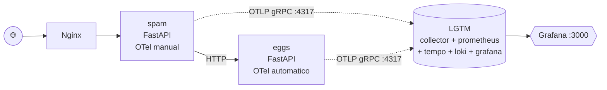

# Aula 2 — Métricas com OpenTelemetry e Prometheus

> Segundo módulo da [série de estudos sobre observabilidade](../README.md), a partir da [Live de Python #263](https://www.youtube.com/watch?v=GvF8hlqaR-c) do Dunossauro.

## O que mudou em relação à aula 1

A aplicação base é a mesma (`spam` + `eggs` + Nginx), mas **deixou de ser cega**: agora cada serviço emite métricas em tempo real, que são armazenadas em um backend de observabilidade e visíveis em um dashboard.

Mais importante para o portfólio: os dois serviços demonstram **estilos diferentes de instrumentação**, lado a lado, no mesmo repositório.

| | spam | eggs |
|---|---|---|
| Tipo de instrumentação | **Manual** (código no app) | **Automática** (zero código) |
| Métricas customizadas | ✅ counter, up-down counter, histogram de domínio | ❌ |
| Métricas HTTP | ❌ (só as que vc quiser instrumentar manualmente) | ✅ via `opentelemetry-instrumentation-fastapi` |
| Métricas de sistema | ❌ | ✅ via `opentelemetry-instrumentation-system-metrics` |
| Onde está a config | `spam/app/telemetria.py` | variáveis de ambiente no `docker-compose.yml` |

Para teoria detalhada veja [`apostila_aula_02.md`](./apostila_aula_02.md).

## Arquitetura



A imagem `grafana/otel-lgtm` é um all-in-one da Grafana que junta o OTel Collector, Prometheus (Mimir), Tempo, Loki e Grafana num único container — perfeito para estudo.

## Como rodar

```bash
docker compose up --build
```

Aguarde até o LGTM ficar saudável (uns 20-30 segundos no primeiro start):

```bash
docker compose ps
# espere ver "(healthy)" na linha do lgtm
```

Endpoints:

| URL | O que é |
|---|---|
| <http://localhost> | Aplicação spam via Nginx |
| <http://localhost:8000/docs> | Swagger do spam (debug direto) |
| <http://localhost:8001/docs> | Swagger do eggs (debug direto) |
| **<http://localhost:3000>** | **Grafana — login `admin`/`admin`** |

## Gerando tráfego para ver métricas

```bash
# bash
for i in {1..50}; do
  curl -s http://localhost/combo/pedro > /dev/null
  curl -s http://localhost/tarefa/3 > /dev/null
done
```

```powershell
# PowerShell
1..50 | ForEach-Object {
  Invoke-WebRequest -UseBasicParsing http://localhost/combo/pedro | Out-Null
  Invoke-WebRequest -UseBasicParsing http://localhost/tarefa/3 | Out-Null
}
```

## Vendo as métricas no Grafana

1. Abra <http://localhost:3000> e faça login.
2. Menu lateral → **Drilldown → Metrics** (ou **Explore**).
3. Procure pelas métricas:

### Métricas customizadas (instrumentação manual no spam)
- `spam_combo_requests_total` — contador de hits no `/combo`
- `spam_requests_in_flight` — gauge de requisições sendo processadas agora
- `spam_eggs_call_duration_milliseconds_bucket` — histograma da latência das chamadas spam → eggs

### Métricas automáticas (instrumentação no eggs)
- `http_server_duration_milliseconds_bucket` — duração das requisições HTTP, por rota/método/status
- `http_server_active_requests` — requisições HTTP em voo
- `http_server_response_size_bytes_bucket` — tamanho das respostas
- `process_runtime_cpython_memory_bytes` — memória do processo Python
- `system_cpu_utilization`, `system_memory_usage`, etc.

### Queries PromQL úteis

```promql
# Taxa de requisições /combo nos últimos 5 minutos
rate(spam_combo_requests_total[5m])

# p95 da latência da chamada spam->eggs
histogram_quantile(0.95,
  rate(spam_eggs_call_duration_milliseconds_bucket[5m])
)

# Throughput HTTP do eggs por rota
sum by (http_route) (
  rate(http_server_duration_milliseconds_count{service_name="eggs"}[5m])
)
```

## Estrutura

```
projeto_2-metricas/
├── README.md
├── apostila_aula_02.md
├── docker-compose.yml          # 4 serviços agora (eggs, spam, nginx, lgtm)
├── requirements.txt            # unificado para rodar local sem docker
├── nginx/
│   └── nginx.conf
├── spam/
│   ├── Dockerfile
│   ├── requirements.txt
│   └── app/
│       ├── __init__.py
│       ├── main.py             # endpoints + middleware "in_flight"
│       └── telemetria.py       # ⭐ os 4 componentes do OTel manual
└── eggs/
    ├── Dockerfile              # ⭐ usa `opentelemetry-instrument` no CMD
    ├── requirements.txt        # ⭐ inclui distro + auto-instrumentations
    └── app/
        ├── __init__.py
        └── main.py             # idêntico à aula 1; OTel injetado de fora
```

Os ⭐ marcam os pontos onde a aula 2 introduz mudanças em relação à aula 1.

## Próximo passo

Aula 3 — **Tracing distribuído** com OpenTelemetry, Tempo e Jaeger. Métricas dizem *quanto*; traces dizem *para onde*.
