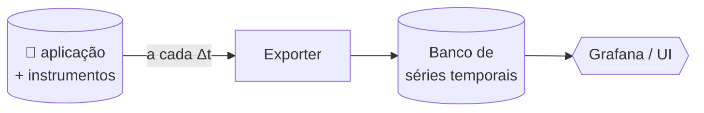
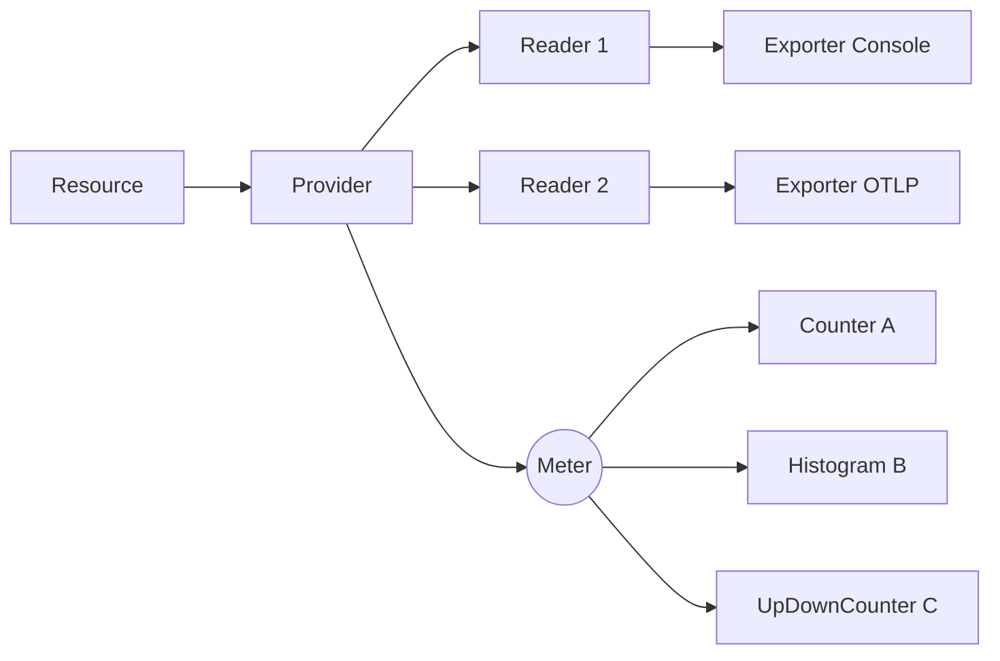

# Aula 2 — Métricas com OpenTelemetry e Prometheus

> Apostila construída a partir da **Live de Python #263 — "Métricas de observabilidade com OpenTelemetry e Prometheus"**, do Eduardo Mendes (Dunossauro). Reinterpretação didática autoral. Crédito completo no README do repositório.

---

## 1. Onde paramos, onde chegamos

Na aula 1 a gente terminou com uma aplicação `spam + eggs` rodando atrás de um Nginx — funcionando, mas **completamente cega**. A última pergunta que ficou no ar foi:

> Como posso entender o que acontece dentro da minha aplicação enquanto isso está acontecendo?

Nessa aula a gente começa a responder essa pergunta plugando o **primeiro tipo de sensor**: as métricas. No final, você vai conseguir abrir um Grafana e ver, em tempo real, quantas requisições seu sistema processou, quão rápido cada uma respondeu, e quantas estão em voo agora — coisas que na aula 1 eram impossíveis de saber.

O roteiro da aula segue o que o Dunossauro propôs na live:

1. **O que são métricas, afinal.** Para quê servem além de "CPU e memória".
2. **Métricas sob a ótica do OpenTelemetry.** Os 7 tipos de instrumento e quando usar cada um.
3. **Instrumentação manual.** Os 4 componentes (Resource, Provider, Reader, Exporter) e como amarrá-los à mão. Vamos fazer isso no `spam`.
4. **Instrumentação automática.** O `opentelemetry-instrument` que faz o trabalho pesado por você. Vamos aplicar no `eggs`.
5. **Backend de métricas.** Prometheus existe, mas vamos usar o `grafana/otel-lgtm` — tudo amarrado em um container só.

---

## 2. Métricas, do zero

### 2.1. Definição prática

**Métrica é um número coletado da sua aplicação em tempo de execução para responder uma pergunta sobre o que está acontecendo durante a execução.** Só isso. A diferença entre um log e uma métrica está em o que cada um fala melhor: log é narrativa textual, métrica é número agregável.

Exemplos de perguntas que viram métricas:

- Quantos requests recebemos? *(contador)*
- Quanto tempo cada um demorou? *(histograma)*
- Quantos requests estão sendo processados agora? *(gauge / up-down counter)*
- Quanto de memória/CPU/disco a aplicação está consumindo? *(gauge)*
- Quantos erros 5xx geramos? *(contador)*
- Quantas conexões estão ativas com o banco? *(up-down counter)*

### 2.2. Métricas vão muito além de "metal"

A primeira armadilha mental é achar que métrica é só sobre infraestrutura. Não é. As mais valiosas geralmente são as de domínio:

- **Operações:** quantos deploys fizemos hoje? Houve erro em algum? Em que VMs?
- **Sistemas auxiliares:** ETLs, scrapers, automações, jobs em fila — tudo pode ser instrumentado.
- **Negócio:** quantas vendas no checkout? Quantos abandonos? Tempo médio de uso por cliente?

A melhor métrica raramente está num dashboard pronto — ela é a que você cria porque ninguém antes mediu aquilo no seu domínio.

### 2.3. Como funciona, em alto nível



A aplicação mantém os instrumentos (counters, gauges, histogramas) atualizados durante a execução. Periodicamente (a cada `Δt`, normalmente 5–60 segundos), um **Reader** pega o snapshot atual de todos os instrumentos e entrega a um **Exporter**, que envia para um banco de séries temporais. O Grafana consulta esse banco e renderiza os gráficos.

> 💡 **Métrica é amostragem temporal.** Você não vê *cada evento*, vê o *agregado* a cada janela. Se você quer cada evento individual, é trace ou log, não métrica.

### 2.4. Visualização ingênua do armazenamento

Imagine uma tabela onde cada linha é uma métrica e cada coluna é uma janela de tempo:

| Métrica | Δ1 | Δ2 | Δ3 | Δ4 | … |
|---|---|---|---|---|---|
| `http.server.requests` | 1 | 6 | 13 | 21 | … |
| `http.server.active_requests` | 2 | 1 | 0 | 7 | … |
| `process.memory.usage` | 25 | 78 | 32 | 17 | … |

Mas na vida real é mais complicado: cada métrica vem com **atributos** (rota, método, status…) e cada combinação distinta de atributos vira uma **série temporal própria**:

| Métrica | Atributos | Δ1 | Δ2 |
|---|---|---|---|
| `http.server.requests` | `{job="spam", method="GET", route="/combo"}` | 1 | 6 |
| `http.server.requests` | `{job="spam", method="GET", route="/eco"}` | 3 | 25 |
| `http.server.requests` | `{job="eggs", method="GET", route="/dados/aleatorio"}` | 7 | 13 |

Isso é o que permite filtrar e agregar nas queries (PromQL: `sum by (route) (rate(http_server_requests_total[5m]))`).

---

## 3. As 4 regras que toda métrica OTel obedece

O OpenTelemetry padroniza a forma como uma métrica é declarada. Toda métrica tem:

1. **Nome** — identificador, em snake_case e geralmente hierárquico (`spam.eggs_call.duration`)
2. **Unidade** — bytes, ms, requests, etc. Curiosamente importante: backends usam isso para escolher escala automática.
3. **Descrição** — texto livre. Ajuda muito quem vai ler o gráfico depois sem ter escrito o código.
4. **Tipo (kind)** — define como o backend vai armazenar e agregar. É a parte que mais exige escolha consciente.

### 3.1. Os 7 tipos de instrumento

O OTel divide os instrumentos em duas categorias:

**Síncronos** (você atualiza no fluxo do código quando o evento acontece):

| Tipo | Quando usa | Exemplos |
|---|---|---|
| **Counter** | Algo que só sobe, monotonicamente. | requisições recebidas, bytes enviados, erros 5xx |
| **UpDownCounter** | Algo que sobe e desce, mas sempre faz sentido somar. | conexões abertas, jobs na fila, requests em voo |
| **Histogram** | Distribuição estatística de valores (p50, p95, p99). | latência de chamada, tamanho de payload |
| **Gauge** | Valor atual, não-aditivo (não faz sentido somar entre instâncias). | temperatura da CPU, saldo da conta |

**Assíncronos** (você fornece um *callback* que o SDK chama na hora da coleta):

| Tipo | Quando usa |
|---|---|
| **Observable Counter** | Mesmo papel do Counter, mas só faz sentido amostrar o "valor cumulativo" no instante da coleta. |
| **Observable UpDownCounter** | Idem para UpDownCounter. |
| **Observable Gauge** | Quando ler "o valor atual" requer chamar uma API ou ler um arquivo — você só quer pagar esse custo quando o reader for coletar. |

> 💡 **Síncrono vs assíncrono não é sobre `async/await` Python.** É sobre *quando o valor da métrica é atualizado*: na hora do evento (síncrono) ou no momento da coleta periódica (assíncrono).

### 3.2. Counter vs UpDownCounter — a confusão clássica

A regra de ouro: **se você um dia vai precisar decrementar, é UpDownCounter. Se nunca, é Counter.** O Prometheus inclusive trata os dois de forma diferente — ele assume que um Counter "puro" só sobe, e usa essa garantia para detectar restarts (quando o valor cai do nada, sabe que reiniciou).

### 3.3. Counter vs Histogram — cuidado com a tentação

Você pode ser tentado a usar dois Counters ("soma do tempo" e "número de chamadas") para calcular média de latência. **Não faça isso.** A média esconde tudo: se 95% das suas requisições demoram 50ms e 5% demoram 5 segundos, a média fica em ~300ms — e você não vê o problema. Histograma te dá os percentis, e p99 é onde mora a verdade sobre experiência do usuário.

### 3.4. Convenções semânticas

Quase toda métrica útil já tem nome canônico definido pela [especificação semantic conventions](https://opentelemetry.io/docs/specs/semconv/general/metrics/) do OTel: `http.server.request.duration`, `http.server.active_requests`, `db.client.connections.usage`, `process.cpu.utilization`… Use esses nomes sempre que possível: dashboards comunitários (e a galera da sua empresa) vão reconhecer de imediato.

Métricas de domínio próprio (ex.: `spam.combo.requests`) você nomeia como quiser, idealmente seguindo o mesmo estilo hierárquico.

---

## 4. Os 4 componentes da instrumentação manual

Quando você instrumenta no braço, precisa amarrar 4 componentes do SDK:



| Componente | Papel | Analogia |
|---|---|---|
| **Resource** | Identifica seu serviço (nome, versão, ambiente). Vira atributo em **toda** métrica. | Plaquinha de identificação no peito |
| **Provider** | Fábrica de Meters; centraliza a configuração. | A "central" da telemetria do processo |
| **Reader** | Coleta as métricas do Provider periodicamente. | Plantão que a cada 5s tira fotos |
| **Exporter** | Sabe falar o protocolo de algum destino (OTLP, Prometheus, console…). | Carteiro que entrega a foto |

E os **instrumentos** (counters, gauges, histogramas) são criados a partir de um `Meter`, que por sua vez é fornecido pelo `Provider`.

Você pode ter **vários Readers** plugados no mesmo Provider — exatamente o que fazemos no nosso `spam`: um Reader exporta para o console (debug rápido) e outro exporta para o LGTM via OTLP gRPC.

### 4.1. Em código

Olha o esqueleto mínimo (versão simplificada do que está em `spam/app/telemetria.py`):

```python
from opentelemetry import metrics
from opentelemetry.sdk.metrics import MeterProvider
from opentelemetry.sdk.metrics.export import (
    ConsoleMetricExporter, PeriodicExportingMetricReader,
)
from opentelemetry.exporter.otlp.proto.grpc.metric_exporter import (
    OTLPMetricExporter,
)
from opentelemetry.sdk.resources import SERVICE_NAME, Resource

# 1. Resource
resource = Resource.create(attributes={SERVICE_NAME: "spam"})

# 2 + 3 + 4. Readers (cada um com seu Exporter)
readers = [
    PeriodicExportingMetricReader(ConsoleMetricExporter()),
    PeriodicExportingMetricReader(
        OTLPMetricExporter(endpoint="http://lgtm:4317", insecure=True)
    ),
]

# 5. Provider amarra resource + readers
provider = MeterProvider(resource=resource, metric_readers=readers)
metrics.set_meter_provider(provider)

# 6. Cria meter e instrumentos a partir dele
meter = metrics.get_meter("meu-app")
contador = meter.create_counter("requests", unit="1")

# 7. Em qualquer lugar do código, atualize:
contador.add(1, attributes={"rota": "/combo", "status": "ok"})
```

> 💡 **Atributos no `add()`**, não na criação. Você cria o instrumento *uma vez*, mas a cada uso pode atribuir labels diferentes. Cada combinação distinta vira uma série temporal — cuidado para não estourar cardinalidade (ex.: nunca use IDs de usuário ou request como atributo).

### 4.2. O que o spam faz com isso

No nosso projeto, criamos três instrumentos customizados:

| Instrumento | Tipo | Pergunta que responde |
|---|---|---|
| `spam.combo.requests` | Counter | Quantas requisições passaram pelo `/combo`, segmentadas por sucesso/erro? |
| `spam.requests.in_flight` | UpDownCounter | Quantas requisições estão sendo processadas pelo spam neste momento? |
| `spam.eggs_call.duration` | Histogram | Qual a distribuição de latência das chamadas que o spam faz ao eggs? |

A escolha de tipos não é aleatória: contagem de eventos (Counter), nível corrente (UpDownCounter), e distribuição estatística (Histogram). Os três tipos síncronos mais úteis no dia-a-dia.

---

## 5. Instrumentação automática

Lembra que dissemos "ganhar telemetria sem mexer no código"? É exatamente o que a galera do OTel chama de **zero-code instrumentation**. A ideia é parasitar o `import` do Python: quando você roda sua app por trás do `opentelemetry-instrument`, ele "patcha" bibliotecas conhecidas (FastAPI, requests, httpx, SQLAlchemy, psycopg…) para emitir telemetria padronizada.

### 5.1. Como ativar

Três passos:

```bash
# 1. Instala o distro (traz o launcher e ferramentas).
pip install opentelemetry-distro opentelemetry-exporter-otlp

# 2. Bootstrap inspeciona seu projeto e instala as instrumentations
#    correspondentes às libs que você usa.
opentelemetry-bootstrap --action=install

# 3. Roda sua app via wrapper.
opentelemetry-instrument uvicorn app.main:app --port 8000
```

Configure tudo via variáveis de ambiente — é assim que a CNCF padronizou:

```bash
export OTEL_SERVICE_NAME=eggs
export OTEL_EXPORTER_OTLP_ENDPOINT=http://lgtm:4317
export OTEL_EXPORTER_OTLP_PROTOCOL=grpc
export OTEL_METRICS_EXPORTER=otlp
export OTEL_TRACES_EXPORTER=none   # ainda não vamos usar traces
export OTEL_LOGS_EXPORTER=none     # nem logs OTel
```

E pronto. Sem uma linha de OTel no `app/main.py`. É assim que o nosso `eggs` é instrumentado.

### 5.2. O que você ganha de graça

Com `opentelemetry-instrumentation-fastapi` + `-asgi` + `-system-metrics`, o eggs passa a exportar:

- **HTTP**: `http.server.duration` (histograma), `http.server.active_requests` (UpDownCounter), `http.server.response.size` (histograma) — por rota/método/status.
- **Sistema**: `system.cpu.utilization`, `system.memory.usage`, `process.runtime.cpython.memory`, e várias outras.

Tudo seguindo as semantic conventions, então o nome bate em qualquer dashboard comunitário.

### 5.3. Quando manual e quando automático?

**Use automático para o que é genérico** — métricas HTTP, de runtime, de sistema, de driver de banco. Esse trabalho já foi feito e refeito 50 vezes pela comunidade; reescrever no braço é desperdício.

**Use manual para o que é seu** — métricas de domínio do seu negócio, contadores específicos do seu fluxo, instrumentos que medem coisas que só você conhece.

**A vida real é híbrida.** O `spam` aqui demonstra os dois mundos coexistindo: você poderia adicionar `opentelemetry-instrument` no `spam` também e ganhar métricas HTTP automáticas *além* das customizadas. Faríamos isso em produção. Mantivemos o spam só com manual aqui para ficar didaticamente claro.

---

## 6. Backend: Prometheus, e o atalho LGTM

### 6.1. Prometheus tradicional (modelo pull)

O Prometheus historicamente trabalha em modo **pull**: ele tem uma lista de "alvos" (jobs) e periodicamente bate em `/metrics` de cada um, lê o snapshot, e armazena. Para isso a sua aplicação precisaria expor um endpoint `/metrics` (via `opentelemetry-exporter-prometheus`).

### 6.2. O que vamos usar — modelo push via OTLP + LGTM

O modelo OTLP é **push**: a aplicação manda os dados para um Collector via gRPC. O Collector (rodando junto com Prometheus, Tempo e Loki) recebe e armazena.

A imagem [`grafana/otel-lgtm`](https://grafana.com/blog/2024/03/13/an-opentelemetry-backend-in-a-docker-image-introducing-grafana/otel-lgtm/) lançada pela Grafana Labs em 2024 amarra tudo em um único container:

| Letra | Componente | Para quê |
|---|---|---|
| **L** | Loki | armazena logs (aula 4) |
| **G** | Grafana | UI de visualização |
| **T** | Tempo | armazena traces (aula 3) |
| **M** | Mimir (compatível com Prometheus) | armazena métricas (essa aula) |

Mais o **OTel Collector** embarcado, escutando em `:4317` (gRPC) e `:4318` (HTTP), prontinho para receber. Para estudo é perfeito. Para produção, separar cada peça em containers/clusters próprios faz mais sentido.

---

## 7. Como rodar e o que ver

### 7.1. Subindo a stack

```bash
docker compose up --build
```

Aguarde alguns segundos até o LGTM ficar com healthcheck verde (`docker compose ps`).

### 7.2. Gerando tráfego

Em outro terminal, dispare requisições:

```bash
# Loop simples para gerar volume
for i in {1..50}; do
  curl -s http://localhost/combo/pedro > /dev/null
  curl -s http://localhost/tarefa/3 > /dev/null
done
```

No PowerShell:

```powershell
1..50 | ForEach-Object {
  Invoke-WebRequest -UseBasicParsing http://localhost/combo/pedro | Out-Null
  Invoke-WebRequest -UseBasicParsing http://localhost/tarefa/3 | Out-Null
}
```

### 7.3. Vendo no Grafana

Abra <http://localhost:3000>. Login: `admin` / `admin` (a primeira tela pede para trocar — pode pular).

1. Vá em **Drilldown → Metrics** (ou no menu lateral, **Explore** com o datasource Prometheus já configurado).
2. Procure suas métricas pelo nome:
   - `spam_combo_requests_total` (manual, no spam)
   - `spam_requests_in_flight` (manual, no spam)
   - `spam_eggs_call_duration_milliseconds_bucket` (histograma manual)
   - `http_server_duration_milliseconds_bucket` (automático, no eggs — histograma da duração)
   - `http_server_active_requests` (automático, no eggs — gauge de requisições em voo)
   - `process_runtime_cpython_memory_bytes` (automático, no eggs)

> 💡 **Conversão de nomes:** o OTel usa `.` no nome da métrica (`spam.combo.requests`); o Prometheus usa `_` (`spam_combo_requests_total`). O sufixo `_total` é adicionado automaticamente em counters; histogramas viram três séries: `_count`, `_sum`, `_bucket`. Não é magia, é convenção.

### 7.4. Algumas queries PromQL para experimentar

```promql
# Taxa de requisições por rota nos últimos 5 minutos
rate(spam_combo_requests_total[5m])

# Quantas requisições em voo agora, por rota
spam_requests_in_flight

# Latência p95 das chamadas spam→eggs
histogram_quantile(0.95,
  rate(spam_eggs_call_duration_milliseconds_bucket[5m])
)

# Quantas requisições HTTP por segundo o eggs recebe (auto-instrum)
rate(http_server_duration_milliseconds_count{service_name="eggs"}[5m])
```

Mexa, segmente por atributo, faça o `sum by`, o `avg by` — métricas existem para serem interrogadas.

---

## 8. Checklist de fixação

- [ ] Sei explicar a diferença entre Counter, UpDownCounter, Gauge e Histogram, com um exemplo de cada.
- [ ] Sei o que cada um dos 4 componentes (Resource, Provider, Reader, Exporter) faz, e por que existem separados.
- [ ] Sei a diferença entre síncrono e assíncrono no OTel (e que não tem nada a ver com `async/await` do Python).
- [ ] Sei quando preferir instrumentação automática e quando preferir manual.
- [ ] Sei por que histograma é melhor que "soma + contagem" para medir latência.
- [ ] Sei o que é cardinalidade de atributos e por que devo evitar atributos com muitos valores possíveis (IDs).
- [ ] Subi a stack, gerei tráfego, e vi métricas no Grafana.

---

## 9. O que vem na próxima aula

Aula 3 — **Tracing com OpenTelemetry, Tempo e Jaeger**. Métricas te dizem *quanto*; traces te dizem *para onde* a requisição foi. Vamos ligar a propagação de contexto entre `spam` e `eggs` para conseguir, em uma única tela, ver o caminho completo de cada requisição individual.

---

## 10. Referências

- **Live original:** Eduardo Mendes (Dunossauro) — "Métricas de observabilidade com OpenTelemetry e Prometheus", Live de Python #263. <https://www.youtube.com/watch?v=GvF8hlqaR-c>
- **Código do Dunossauro:** <https://github.com/dunossauro/live-de-python/tree/main/codigo/Live263>
- **OpenTelemetry Python — Metrics API:** <https://opentelemetry.io/docs/languages/python/instrumentation/#metrics>
- **Semantic Conventions (Métricas):** <https://opentelemetry.io/docs/specs/semconv/general/metrics/>
- **grafana/otel-lgtm:** <https://grafana.com/blog/2024/03/13/an-opentelemetry-backend-in-a-docker-image-introducing-grafana/otel-lgtm/>
- **PromQL básico:** <https://prometheus.io/docs/prometheus/latest/querying/basics/>
