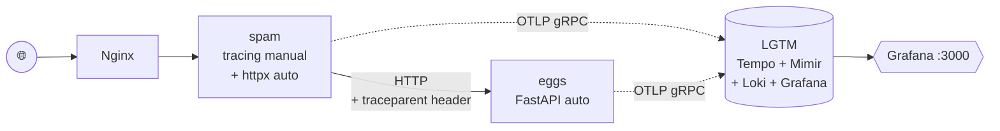

# Aula 3 — Tracing distribuído com OpenTelemetry, Tempo e Jaeger

> Terceiro módulo da [série de estudos sobre observabilidade](../README.md), a partir da [Live de Python #265](https://github.com/dunossauro/live-de-python/tree/main/codigo/Live265) do Dunossauro.

## O que mudou em relação à aula 2

Aula 2 adicionou o "**quanto**" (métricas). Aula 3 adiciona o "**para onde**": agora cada requisição individual que atravessa o `spam` e o `eggs` deixa um rastro completo, com cada salto identificado e cronometrado, visível como cascata no Grafana Tempo.

Mais importante para o portfólio: a aula 3 demonstra **propagação de contexto W3C** — o conceito sem o qual "distributed tracing" não passa de "tracing local em vários lugares desconectados".

| | spam | eggs |
|---|---|---|
| Setup de traces | **Manual** (`spam/app/tracing.py`) | **Automático** (variável de ambiente) |
| Spans manuais customizados | ✅ `spam.combo`, `spam.combo.chamada_eggs`, `spam.tarefa`, `spam.tarefa.iteracao` | ❌ |
| Spans HTTP de servidor | ❌ | ✅ via `opentelemetry-instrumentation-fastapi` |
| Spans HTTP de cliente | ✅ via `opentelemetry-instrumentation-httpx` | n/a |
| Propagação de contexto | ✅ httpx injeta `traceparent` | ✅ FastAPI lê `traceparent` |
| Status + Events em erros | ✅ no `/combo` quando o eggs falha | ✅ auto-instrumentação |
| Backend | Grafana Tempo (dentro do LGTM) | mesma coisa |

Para teoria detalhada veja [`apostila_aula_03.md`](./apostila_aula_03.md).

## Arquitetura



A propagação acontece via o header HTTP `traceparent` (padrão W3C). Quando o `spam` chama o `eggs`, o `httpx` auto-instrumentado injeta esse header automaticamente. O FastAPI no `eggs` lê o header e continua o **mesmo trace** que o spam iniciou.

## Como rodar

```bash
docker compose up --build
```

Espere o `lgtm` ficar `healthy` (~30 segundos no primeiro start):

```bash
docker compose ps
```

Endpoints:

| URL | O que é |
|---|---|
| <http://localhost> | App spam via Nginx |
| <http://localhost:8000/docs> | Swagger do spam |
| <http://localhost:8001/docs> | Swagger do eggs |
| **<http://localhost:3000>** | **Grafana — login `admin`/`admin`** |

## Gerando traces para ver

```bash
# bash
for i in {1..20}; do
  curl -s http://localhost/combo/pedro$i > /dev/null
  curl -s http://localhost/tarefa/3 > /dev/null
done
```

```powershell
# PowerShell
1..20 | ForEach-Object {
  Invoke-WebRequest -UseBasicParsing "http://localhost/combo/pedro$_" | Out-Null
  Invoke-WebRequest -UseBasicParsing "http://localhost/tarefa/3" | Out-Null
}
```

## Vendo no Grafana Tempo

1. Abra <http://localhost:3000> (`admin`/`admin`).
2. Menu lateral → **Explore**.
3. No seletor de datasource (canto superior esquerdo), troque para **Tempo**.
4. Aba **Search** → **Service Name = spam** → **Run query**.
5. Clique em qualquer trace da lista.

Você vai ver uma **cascata vertical** dos spans, atravessando `spam → eggs` no mesmo trace. Clique em cada span para ver atributos (`app.nome_param`, `app.dado_do_eggs`, `http.method`, etc.) e events.

## Spans criados nessa aula

### No spam (manuais)
- `spam.combo` — span pai do endpoint /combo. Atributos: `app.nome_param`, `app.endpoint`, `app.dado_do_eggs`. Em caso de falha do eggs, recebe event `falha_na_chamada_eggs` e status ERROR.
- `spam.combo.chamada_eggs` — span filho que envolve só o trecho HTTP.
- `spam.tarefa` — span pai do endpoint /tarefa, com atributo `app.n_chamadas`.
- `spam.tarefa.iteracao` — span filho criado a cada iteração, com `app.iteracao=N`.

### No spam (automáticos via httpx)
- Span HTTP CLIENT criado pelo `opentelemetry-instrumentation-httpx` para cada chamada httpx — é esse que injeta o `traceparent`.

### No eggs (automáticos)
- Spans HTTP SERVER criados pelo `opentelemetry-instrumentation-fastapi` — um por requisição que chega no eggs, com atributos `http.method`, `http.route`, `http.status_code`, etc.

## Experimente cenários de erro

Pare o eggs:
```bash
docker compose stop eggs
```

Bata no spam (deve dar 502):
```bash
curl http://localhost/combo/pedro
```

Abra o trace no Grafana. Você vai ver o span `spam.combo` com **status vermelho (ERROR)**, um **event `falha_na_chamada_eggs`** com o atributo `erro` contendo a mensagem, e o trace **não continua para o eggs** (porque ele estava parado).

Suba de volta:
```bash
docker compose start eggs
```

Esse exercício é didático: você acabou de fazer um **postmortem em miniatura** usando observabilidade.

## Estrutura

```
projeto_3-tracing/
├── README.md
├── apostila_aula_03.md
├── docker-compose.yml          # ⭐ OTEL_TRACES_EXPORTER=otlp ligado
├── requirements.txt
├── nginx/
│   └── nginx.conf
├── spam/
│   ├── Dockerfile
│   ├── requirements.txt        # ⭐ + opentelemetry-instrumentation-httpx
│   └── app/
│       ├── __init__.py
│       ├── main.py             # ⭐ usa tracer + spans manuais
│       ├── telemetria.py       # mantém métricas da aula 2
│       └── tracing.py          # ⭐ NOVO — os 3 componentes do tracing
└── eggs/
    ├── Dockerfile              # idêntico à aula 2 (opentelemetry-instrument)
    ├── requirements.txt
    └── app/
        ├── __init__.py
        └── main.py             # idêntico à aula 1; ganha traces só via env vars
```

Os ⭐ marcam o que muda em relação à aula 2.

## Próximo passo

Aula 4 — **Logs com OpenTelemetry e Loki**. Vamos amarrar logs ao mesmo `trace_id` para conseguir, a partir de um trace problemático, ler os logs exatos daquela requisição.
