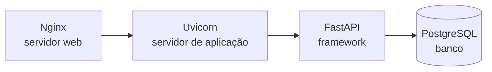
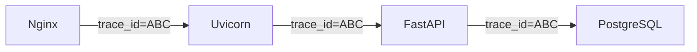
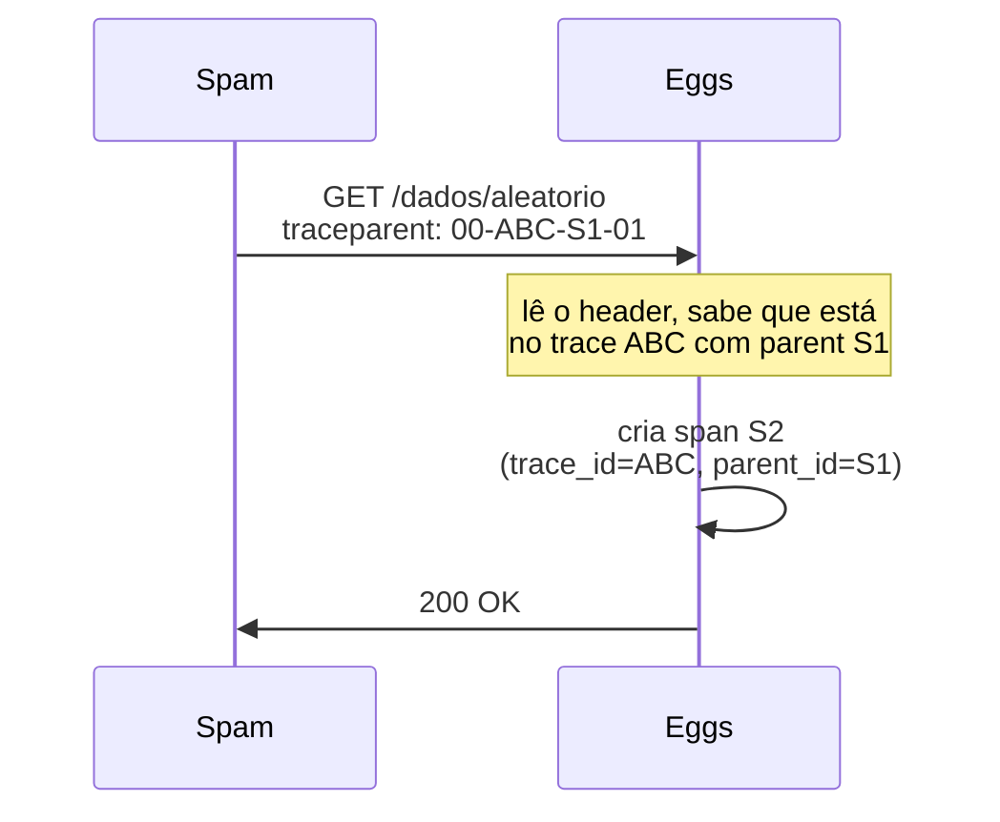
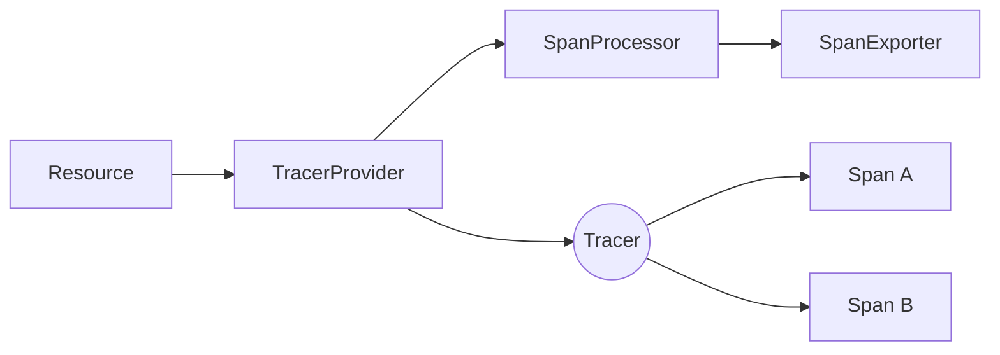

# Aula 3 — Tracing distribuído com OpenTelemetry, Tempo e Jaeger

> Apostila construída a partir da **Live de Python #265 — "Distributed Tracing"**, do Eduardo Mendes (Dunossauro). Reinterpretação didática autoral. Crédito completo no README do repositório.

---

## 1. Onde paramos, onde chegamos

Na aula 2 a gente plugou o primeiro tipo de sensor — métricas. A pergunta "quanto" virou observável: quantos requests, quanta latência, quanto consumo de memória. Mas se você tentou usar o que construímos para investigar um problema específico — tipo "**aquele** request específico que demorou 3 segundos, o que ele fez?" — você bate num muro. Métrica só te dá agregados; ela não te conta a história de uma requisição individual.

Tracing nasce para resolver isso. No fim dessa aula, você vai abrir o Grafana, clicar num trace individual, e ver uma cascata mostrando exatamente por onde aquela requisição passou: chegou no `spam`, fez uma chamada para o `eggs`, e cada salto com sua duração precisa.

A aula segue exatamente o roteiro do Dunossauro:

1. **Vocabulário de nicho.** O que significa "trace", o que significa "distribuído", e por que essas duas palavras juntas resolvem um problema real.
2. **OTel e tracing.** Os 5 conceitos centrais: Trace, Span, Context Propagation, Events, Sampling.
3. **Instrumentação manual.** Os 3 componentes (Resource, TracerProvider, SpanProcessor) e como amarrá-los à mão. Aplicado no `spam`.
4. **Instrumentação automática.** Como o `eggs` ganha tracing sem mexer no código de produção.

---

## 2. Vocabulário de nicho

### 2.1. "Trace": as duas faces da mesma palavra

Em inglês, *trace* é tanto verbo quanto substantivo:

- **Verbo**: encontrar algo perdido; descobrir a causa ou origem de algo.
- **Substantivo**: um sinal de que algo aconteceu ou existiu — uma pegada, um rastro.

Os dois sentidos casam para o que queremos: a gente quer um sistema que **deixa rastros enquanto roda**, para que a gente possa **rastrear (descobrir a origem)** de qualquer comportamento depois.

### 2.2. Trace de software (o conceito original)

Pré-OpenTelemetry, "trace" já era um termo conhecido em Python. Veja:

```python
# exemplo_01.py
def d(): return 1 / 0
def c(): return d()
def b(): return c()
def a(): return b()
a()
```

Roda isso e o Python te dá um **traceback**:

```
Traceback (most recent call last):
  File "exemplo_01.py", line 7, in <module>
    a()
  File "exemplo_01.py", line 4, in a
    def a(): return b()
  File "exemplo_01.py", line 3, in b
    def b(): return c()
  File "exemplo_01.py", line 2, in c
    def c(): return d()
  File "exemplo_01.py", line 1, in d
    def d(): return 1 / 0
ZeroDivisionError: division by zero
```

Isso é literalmente o **rastro de execução** das chamadas de função, mostrando como o código chegou no ponto onde quebrou. Você pode ver a mesma coisa, sem erro, com `python -m trace -T exemplo_01.py` — o Python te mostra `a → b → c → d`.

Guarde a imagem mental: **trace é a sequência de subprogramas (ou serviços) que uma operação atravessou**.

### 2.3. Trace de rede

Quando uma requisição HTTP sai do seu computador para acessar um site, ela atravessa vários roteadores até chegar no servidor — meios guiados (cabos, fibras) e não-guiados (Wi-Fi). O comando `traceroute` mostra exatamente esse caminho:

```bash
$ traceroute github.com
 1  192.168.0.1          1.234 ms
 2  10.0.0.1             5.678 ms
 3  isp-router.net       12.45 ms
 4  ...
 8  github.com           45.67 ms
```

Cada linha é um salto na rede, com a latência daquele salto.

Note a analogia: tanto o traceback de software quanto o traceroute de rede mostram **uma sequência de etapas e o que cada etapa fez**. O **distributed tracing** vai unificar essas duas visões.

### 2.4. Sistemas distribuídos

Quando você tem **dois ou mais componentes precisando cooperar para resolver uma tarefa**, você tem um sistema distribuído. Isso inclui:

- Uma aplicação web + um banco de dados (sim, isso já é "distribuído")
- Aplicação + cache + banco
- Microsserviços: várias pequenas aplicações compartilhando a resolução de tarefas

Mas vai mais longe que isso. Mesmo dentro de **uma única aplicação web** existe distribuição de responsabilidades:



Cada caixinha é um pedaço de software *escrito por outra pessoa*, com sua própria forma de falar, seus próprios logs, seus próprios bugs. Mesmo num "monólito clássico" você já tem 4 sistemas atravessados a cada request.

### 2.5. Distributed tracing: a soma

A ideia central do tracing distribuído é **unificar o rastro de software com o rastro de rede**:

```
1. Cliente faz POST /login no Nginx
2. Nginx delega para o Uvicorn
3. Uvicorn passa para o FastAPI
4. FastAPI roda a função do endpoint
5. A função valida payload, chama banco, criptografa senha, gera JWT...
```

O que queremos é ver, em **uma única visualização**, todo esse caminho — cada etapa, cada duração, cada decisão (validação ok? usuário existe? senha confere?). Não é teoria: é exatamente o que o Grafana Tempo vai mostrar pra gente no final.

### 2.6. Onde os traces vão morar

Os dois bancos mais usados:

| Ferramenta | Origem | Observação |
|---|---|---|
| **Jaeger** | Uber, hoje sob a CNCF | UI focada em busca por trace específico. Padrão de fato por muitos anos. |
| **Grafana Tempo** | Grafana Labs | Otimizado para storage barato (S3-compatible), excelente integração nativa no Grafana. |

Vamos usar o **Tempo**, porque já vem dentro da imagem `grafana/otel-lgtm` que estamos usando desde a aula 2. Mas o formato (OTLP) é o mesmo — trocar de Tempo para Jaeger é mexer no docker-compose, não no código da aplicação. **Esse é o poder da padronização do OpenTelemetry.**

---

## 3. Tracing sob a ótica do OTel

O OpenTelemetry organiza tracing em cinco conceitos. Esses cinco nomes vão aparecer em toda documentação, toda biblioteca, toda configuração:

### 3.1. Trace

**Trace é o caminho de uma requisição observada pelo OTel.** Tem um identificador único — o **trace ID** — que precisa ser carregado em todas as chamadas entre sistemas:



Se o trace ID se perde entre dois componentes (por exemplo, o Nginx não repassa o header), você acaba com dois traces desconectados em vez de um trace contínuo. É o erro #1 em produção.

### 3.2. Span

**Spans são os "vãos" em que o sistema fez uma determinada tarefa.** Se trace é o caminho inteiro, cada span é um pedaço dele.

Um span carrega:

- **ID** — identificador único *do span*
- **Trace ID** — qual trace ele pertence
- **Parent ID** — qual outro span "criou" esse (forma a árvore)
- **Nome** — humano-legível ("buscar usuário no banco", "validar token JWT")
- **Tempo de início e fim** — quando começou e terminou
- **Atributos** — chaves/valores arbitrários ("usuario_id=42", "rota=/login")
- **Eventos** — coisas que aconteceram *dentro* do span (mais sobre isso já)
- **Status** — UNSET, OK ou ERROR

Visualmente, um trace é uma árvore de spans:

```
Trace ABC
└─ Span: POST /login          (5ms - 250ms)
   ├─ Span: validar_payload   (5ms - 8ms)
   ├─ Span: buscar_usuario    (8ms - 180ms)
   │  └─ Span: SQL SELECT     (12ms - 178ms)
   └─ Span: gerar_jwt         (180ms - 250ms)
```

Cada nó tem início, fim e relação com o pai. É isso que vira a **cascata** no Tempo/Jaeger.

### 3.3. Propagação de contexto

**Esse é o conceito que faz "distribuído" funcionar.** Quando o `spam` chama o `eggs` via HTTP, como o `eggs` sabe que aquela requisição pertence a um trace que o `spam` iniciou?

Resposta: o `spam` **injeta um header** na requisição saindo. A W3C padronizou o formato como `traceparent`:

```
traceparent: 00-d679d965422fd3a9210830c5c28a0f9b-894c33993a0cadef-01
              │  └────── trace ID (16 bytes) ──┘ └─ parent span ID ─┘ └─ flags
              └─ versão
```



O resultado: spans criados em servidores diferentes acabam no mesmo `trace_id`, com relação pai→filho correta. **No Grafana você abre um trace e vê o caminho inteiro como se fosse uma única aplicação.**

Quem injeta esse header pra você? A **instrumentação automática** das bibliotecas HTTP — `opentelemetry-instrumentation-httpx`, `-requests`, etc. É só ativar e funciona.

### 3.4. Events

Um **evento** é algo significativo que aconteceu *dentro* de um span, num instante específico. Pense como log estruturado anexado ao span:

```python
with tracer.start_as_current_span("criar_task", attributes=task.model_dump()) as span:
    with Session() as s:
        _task = Task(**task.model_dump())
        s.add(_task)
        s.commit()
        s.refresh(_task)

    span.add_event(
        "registro_inserido_no_banco",
        attributes={"id": _task.id},
    )
    return _task
```

Quando isso roda, no Tempo o span `criar_task` aparece com um marcador "registro_inserido_no_banco" no exato momento em que ocorreu. Útil para:

- Sinalizar que uma exception foi suprimida (`exception_capturada`)
- Indicar uma retry (`tentativa_2_de_3`)
- Marcar momentos de negócio (`pagamento_aprovado`, `notificacao_enviada`)

### 3.5. Convenções semânticas

Igual nas métricas, o OTel padronizou nomes de spans e atributos para coisas comuns: `http.request.method`, `http.response.status_code`, `db.statement`, `rpc.service`… A [especificação completa](https://opentelemetry.io/docs/specs/semconv/general/trace/) é longa, mas a regra prática é: para coisas comuns (HTTP, banco, mensageria, RPC), **deixa a auto-instrumentação cuidar** — ela usa os nomes canônicos por padrão. Para spans de domínio próprio, use nomes legíveis (`spam.combo.chamada_eggs` é bom; `do_thing_v2` é ruim).

### 3.6. Sampling

Em produção real, gravar **todo** trace de **todo** request é inviável — milhões de requests/hora viram terabytes de dados que ninguém vai consultar. **Sampling** é o processo de escolher um subconjunto representativo para guardar.

Estratégias comuns:

- **Head-based fixo**: "guardo 1% de tudo, aleatório, decidido no início do trace". Simples, mas pode perder o trace daquele 0.01% catastrófico.
- **Head-based parent-based** (padrão do OTel): a decisão de sampling se propaga via traceparent. Se o `spam` decidiu manter, o `eggs` mantém o mesmo trace inteiro. Garante traces coerentes.
- **Tail-based**: "deixa o trace inteiro fluir; só decido guardar depois de ver o resultado — guardo todos com erro, guardo todos lentos, e amostro o resto". Mais inteligente, mais caro de operar (precisa de buffering no Collector).

Para esse projeto vamos manter o sampler padrão (parent-based, AlwaysOn). Em produção real, esse é um dos primeiros knobs a ajustar.

---

## 4. Instrumentação manual: os 3 componentes do trace

O paralelo com métricas (aula 2) é direto. Onde lá tínhamos `Resource → MeterProvider → MetricReader → Exporter`, aqui temos:



| Componente | Papel |
|---|---|
| **Resource** | Identifica o serviço (mesmo objeto da aula 2 — vira atributo em todo span) |
| **TracerProvider** | Fábrica de Tracers; centraliza a configuração de traces no processo |
| **SpanProcessor** | Decide *quando* e *como* exportar os spans (síncrono vs batch) |
| **SpanExporter** | Sabe falar o protocolo de destino (OTLP, Console, Jaeger, …) |

A diferença importante em relação a métricas: spans são **eventos discretos**, não amostras periódicas. Por isso aqui falamos em **Processor** (não em Reader). Os dois mais comuns:

- `SimpleSpanProcessor` — exporta o span imediatamente quando ele termina. Bom para debug, péssimo para performance (uma chamada por span!).
- `BatchSpanProcessor` — acumula spans num buffer e envia em lote periodicamente. **Padrão para produção.**

### 4.1. Em código

Esqueleto mínimo (versão simplificada do nosso `spam/app/tracing.py`):

```python
from opentelemetry import trace
from opentelemetry.sdk.resources import SERVICE_NAME, Resource
from opentelemetry.sdk.trace import TracerProvider
from opentelemetry.sdk.trace.export import BatchSpanProcessor
from opentelemetry.exporter.otlp.proto.grpc.trace_exporter import OTLPSpanExporter

# 1. Resource
resource = Resource.create({SERVICE_NAME: "spam"})

# 2. Provider
provider = TracerProvider(resource=resource)

# 3+4. Processor + Exporter
provider.add_span_processor(
    BatchSpanProcessor(OTLPSpanExporter(endpoint="http://lgtm:4317", insecure=True))
)

# 5. Provider global
trace.set_tracer_provider(provider)

# 6. Tracer pronto para uso
tracer = trace.get_tracer("spam", "0.3.0")

# 7. Em qualquer lugar do código:
with tracer.start_as_current_span("minha_operacao", attributes={"foo": "bar"}) as span:
    # ... faz a operação ...
    span.add_event("algo_aconteceu", attributes={"detalhe": 42})
```

### 4.2. O que o spam faz com isso

Em `spam/app/main.py` da aula 3, o endpoint `/combo` cria dois spans aninhados:

```python
with tracer.start_as_current_span("spam.combo") as span:
    span.set_attribute("app.nome_param", nome)

    with tracer.start_as_current_span("spam.combo.chamada_eggs"):
        async with httpx.AsyncClient() as client:
            resposta = await client.get(f"{EGGS_URL}/dados/aleatorio")
            # ↑ aqui o httpx auto-instrumentado cria um SPAN_KIND_CLIENT
            # e injeta o traceparent no header. O eggs recebe e continua o trace.

    span.set_attribute("app.dado_do_eggs", resposta.json()["valor"])
```

O resultado no Tempo é uma cascata com **3 níveis** para essa rota: o `spam.combo`, o `spam.combo.chamada_eggs`, e o span CLIENT criado pelo httpx — todos no mesmo trace, com `parent_id` linkando corretamente.

### 4.3. Verificando que a propagação funcionou

Quando você roda nossa app local com `SPAM_TRACE_TO_CONSOLE=true`, vai ver os spans em JSON. Procure por dois spans com `trace_id` idêntico mas `service.name` diferentes (`spam` e `eggs`): se aparecem, propagação ok. Se cada serviço tiver um `trace_id` próprio, o `traceparent` não chegou — provavelmente esqueceu de ativar o `HTTPXClientInstrumentor()`.

---

## 5. Instrumentação automática

Para o `eggs`, a abordagem é a mesma da aula 2 com métricas: **zero código novo na aplicação**, só uma mudança de variável de ambiente:

```yaml
# docker-compose.yml — antes (aula 2)
OTEL_TRACES_EXPORTER: none

# docker-compose.yml — agora (aula 3)
OTEL_TRACES_EXPORTER: otlp
```

Pronto. Por trás disso, o `opentelemetry-instrument` (lembra do CMD no Dockerfile do eggs?):

- Detecta que FastAPI está instalado → patcha para criar um span SERVER por request, lendo o `traceparent` que o spam enviou.
- Detecta as semantic conventions HTTP → adiciona atributos padronizados (`http.method`, `http.route`, `http.status_code`, etc.).
- Manda os spans para o LGTM via OTLP gRPC.

Como o `eggs` lê o `traceparent` do header, ele **continua o trace do spam** em vez de iniciar um novo. É a propagação acontecendo automaticamente, dos dois lados.

### 5.1. Quando manual e quando automático?

A regra é a mesma da aula 2:

- **Automático** para o que é mecânico e padronizado (spans HTTP de servidor, spans de cliente HTTP, spans de driver de banco). Esse trabalho já foi feito; reescrever é desperdício.
- **Manual** para spans de domínio — funções específicas de negócio, regras críticas que você quer destacar separadamente.

**Vida real é híbrida.** Nosso projeto demonstra isso: o `spam` tem manual + auto-instrumentação do httpx; o `eggs` é puramente automático.

---

## 6. Como rodar e o que ver

### 6.1. Subindo

```bash
docker compose up --build
```

Espere o `lgtm` ficar `healthy` (`docker compose ps`).

### 6.2. Gerando traces

```bash
# bash
for i in {1..20}; do
  curl -s http://localhost/combo/pedro$i > /dev/null
  curl -s http://localhost/tarefa/3 > /dev/null
done
```

```powershell
# PowerShell
1..20 | ForEach-Object {
  Invoke-WebRequest -UseBasicParsing "http://localhost/combo/pedro$_" | Out-Null
  Invoke-WebRequest -UseBasicParsing "http://localhost/tarefa/3" | Out-Null
}
```

### 6.3. Vendo no Grafana

Abra <http://localhost:3000> (login `admin`/`admin`).

1. Menu lateral → **Explore**.
2. No canto superior esquerdo, troque o datasource para **Tempo**.
3. Aba **Search** → **Service Name = spam** → **Run query**.
4. Vai aparecer uma lista de traces recentes. Clique num.

O que você verá: uma **cascata vertical** com `spam → spam.combo → spam.combo.chamada_eggs → HTTP GET (httpx) → eggs:GET /dados/aleatorio`. Cada barra horizontal indica início + duração, o nome do serviço fica à esquerda em cores diferentes (spam azul, eggs verde, por exemplo). Clique em qualquer span para ver atributos e events.

### 6.4. Coisas legais para experimentar

- **Trace de `/tarefa/5`**: você vê 5 iterações claras, uma após a outra, com a soma das durações batendo com a latência total. Bom exemplo de chamadas sequenciais — daria pra paralelizar, e o trace é onde isso fica óbvio.
- **Trace de erro**: pare o `eggs` (`docker compose stop eggs`) e bata em `/combo/pedro`. O trace vai mostrar o span do spam com status ERROR, evento `falha_na_chamada_eggs`, e o atributo `erro` com a mensagem. Suba o eggs de volta (`docker compose start eggs`) e veja como ficou registrado.
- **Correlação trace↔métrica**: nos paineis do Grafana, é possível clicar no datapoint de uma métrica que tem `exemplars` (traces de exemplo associados) e abrir o trace correspondente. Funcionalidade premium do LGTM.

---

## 7. Checklist de fixação

- [ ] Sei explicar a diferença entre Trace e Span com minhas palavras.
- [ ] Sei o que é Trace ID, Span ID, Parent ID e como eles formam uma árvore.
- [ ] Sei o que é o header `traceparent` e por que ele é necessário para o tracing ser *distribuído*.
- [ ] Sei a diferença entre SimpleSpanProcessor e BatchSpanProcessor — e qual usar em produção.
- [ ] Entendo o que é Event de span e em que situação adicionar um.
- [ ] Sei o que é Sampling e por que 100% raramente faz sentido em produção.
- [ ] Subi a stack, gerei tráfego, abri um trace no Tempo, vi a cascata atravessando `spam` e `eggs` com o mesmo `trace_id`.

---

## 8. O que vem na próxima aula

Aula 4 — **Logs com OpenTelemetry e Loki**. Métricas dizem *quanto*, traces dizem *para onde*, logs dizem *o que aconteceu em texto livre*. Vamos amarrar logs aos traces que já temos (mesmo `trace_id`!) para conseguir, a partir de um trace problemático, ver os logs daquela requisição específica — e vice-versa.

---

## 9. Referências

- **Live original**: Eduardo Mendes (Dunossauro) — "Distributed Tracing", Live de Python #265.
- **Código do Dunossauro**: <https://github.com/dunossauro/live-de-python/tree/main/codigo/Live265>
- **OpenTelemetry — Traces conceitualmente**: <https://opentelemetry.io/docs/concepts/signals/traces/>
- **OpenTelemetry — Context Propagation**: <https://opentelemetry.io/docs/concepts/context-propagation/>
- **OpenTelemetry — Sampling**: <https://opentelemetry.io/docs/concepts/sampling/>
- **W3C Trace Context**: <https://www.w3.org/TR/trace-context/>
- **Semantic Conventions (traces)**: <https://opentelemetry.io/docs/specs/semconv/general/trace/>
- **Grafana Tempo**: <https://grafana.com/docs/tempo/latest/>
- **Jaeger**: <https://www.jaegertracing.io/>
- **Python `trace` builtin**: <https://docs.python.org/3/library/trace.html>
