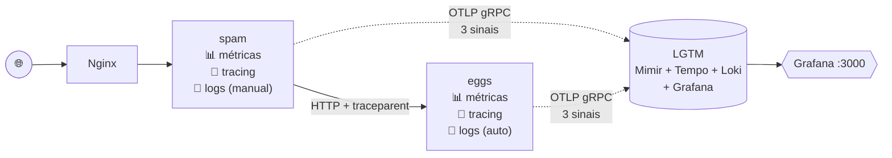

# Aula 4 — Logs com OpenTelemetry e Loki

> Quarto módulo da [série de estudos sobre observabilidade](../README.md), a partir da [Live de Python #266](https://github.com/dunossauro/live-de-python/tree/main/codigo/Live266) do Dunossauro.

## O que mudou em relação à aula 3

A aula 3 ligou o "para onde" (traces). A aula 4 fecha a trinca clássica da observabilidade ligando o **"o que aconteceu"** (logs) — e, mais importante, **amarrando logs aos traces** via injeção automática de `trace_id` e `span_id` em cada linha de log.

| | spam | eggs |
|---|---|---|
| Setup de logs | **Manual** (`spam/app/logging_otel.py`) | **Automático** (variáveis de ambiente) |
| Logs customizados na app | ✅ em pontos-chave de cada endpoint | ✅ em pontos-chave de cada endpoint |
| Bridge `logging` stdlib → OTLP | ✅ manual via `LoggingHandler` | ✅ via `opentelemetry-instrumentation-logging` |
| Injeção de `trace_id` / `span_id` no log | ✅ automática pelo LoggingHandler | ✅ via `OTEL_PYTHON_LOG_CORRELATION=true` |
| Backend | Grafana Loki (dentro do LGTM) | mesma coisa |

Para teoria detalhada veja [`apostila_aula_04.md`](./apostila_aula_04.md).

> ⚠️ **Nota sobre estado da API:** o sinal de logs no pacote Python ainda mantém imports prefixados com `_` (`opentelemetry._logs`, `opentelemetry.sdk._logs`) por compatibilidade, embora a especificação esteja marcada como Stable. A apostila tem uma seção dedicada explicando isso.

## Arquitetura



A magia: cada log emitido dentro de uma requisição instrumentada **carrega automaticamente o `trace_id` da requisição**. No Grafana, isso permite navegar de um trace lento direto para os logs daquela requisição específica.

## Como rodar

```bash
docker compose up --build
```

Aguarde o `lgtm` ficar `healthy`:

```bash
docker compose ps
```

Endpoints:

| URL | O que é |
|---|---|
| <http://localhost> | App spam via Nginx |
| <http://localhost:8000/docs> | Swagger do spam |
| <http://localhost:8001/docs> | Swagger do eggs |
| **<http://localhost:3000>** | **Grafana — login `admin`/`admin`** |

## Gerando logs para ver

```bash
# Tráfego normal
for i in {1..15}; do
  curl -s http://localhost/combo/pedro$i > /dev/null
  curl -s http://localhost/tarefa/3 > /dev/null
done

# Erros propositais
curl http://localhost/tarefa/99      # 400 — n inválido
curl http://localhost:8001/fibonacci/-1  # 400 — n negativo

# Falha do upstream
docker compose stop eggs
curl http://localhost/combo/teste    # 502
docker compose start eggs
```

```powershell
# PowerShell equivalente
1..15 | ForEach-Object {
  Invoke-WebRequest -UseBasicParsing "http://localhost/combo/pedro$_" | Out-Null
  Invoke-WebRequest -UseBasicParsing "http://localhost/tarefa/3" | Out-Null
}
```

## Vendo no Grafana Loki

1. Abra <http://localhost:3000> (`admin`/`admin`).
2. Menu lateral → **Explore**.
3. Datasource → **Loki**.
4. No campo de query:
   ```
   {service_name="spam"}
   ```
5. **Run query**.

Cada linha pode ser expandida para ver `trace_id`, `span_id`, `severity_text`, atributos extras (`nome`, `duracao_ms`, `erro`, etc.).

### Queries LogQL úteis

```logql
# Todos os logs dos dois serviços
{service_name=~"spam|eggs"}

# Só erros
{service_name=~"spam|eggs"} |= "ERROR"

# Endpoint /combo
{service_name="spam"} |= "combo"

# Logs de um trace específico (cole um trace_id real)
{service_name=~"spam|eggs"} |= "<trace_id_aqui>"

# Logs de warnings + errors agregados por serviço
sum by (service_name) (count_over_time({service_name=~".+"} |~ "ERROR|WARNING" [5m]))
```

## ⭐ O momento eureka — navegando trace → log

1. Em **Explore**, escolha datasource **Tempo**.
2. Aba **Search**, **Service Name = spam**, **Run query**.
3. Clique em qualquer trace da lista.
4. Na visualização da cascata, clique num span.
5. No painel à direita, role até **Logs for this span**.
6. O Grafana abre automaticamente o Loki filtrado pelo `trace_id` daquele span — **você vê exatamente os logs daquela requisição**.

Faça o caminho inverso também:

1. Em **Loki**, filtre por `{service_name="spam"} |= "ERROR"`.
2. Numa linha de erro, copie o `trace_id`.
3. Cole no campo **Trace ID** do datasource Tempo.
4. **Run** — você vê a cascata daquela requisição que falhou.

Esse fluxo bidirecional **traces ↔ logs** é o ouro da observabilidade moderna.

## Estrutura

```
projeto_4-logs/
├── README.md
├── apostila_aula_04.md
├── docker-compose.yml          # ⭐ OTEL_LOGS_EXPORTER=otlp ligado
├── requirements.txt
├── nginx/
│   └── nginx.conf
├── spam/
│   ├── Dockerfile
│   ├── requirements.txt
│   └── app/
│       ├── __init__.py
│       ├── main.py             # ⭐ logger.info/error em pontos-chave
│       ├── telemetria.py       # métricas (aula 2)
│       ├── tracing.py          # tracing (aula 3)
│       └── logging_otel.py     # ⭐ NOVO — bridge OTel/stdlib
└── eggs/
    ├── Dockerfile              # idêntico desde aula 2
    ├── requirements.txt        # ⭐ + opentelemetry-instrumentation-logging
    └── app/
        ├── __init__.py
        └── main.py             # ⭐ + alguns logger.info (mas sem setup OTel!)
```

Os ⭐ marcam o que muda em relação à aula 3.

## Próximo passo

Aula 5 — **Logfire como alternativa gerenciada**. Vamos ver como uma plataforma proprietária (da Pydantic) abstrai parte desse setup, e comparar trade-offs entre stack self-hosted (LGTM) e SaaS.
