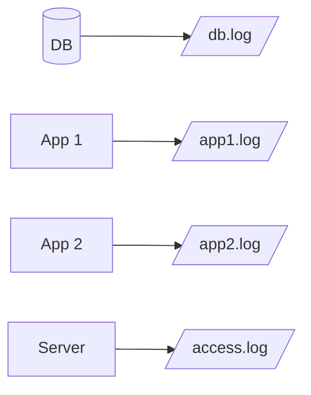
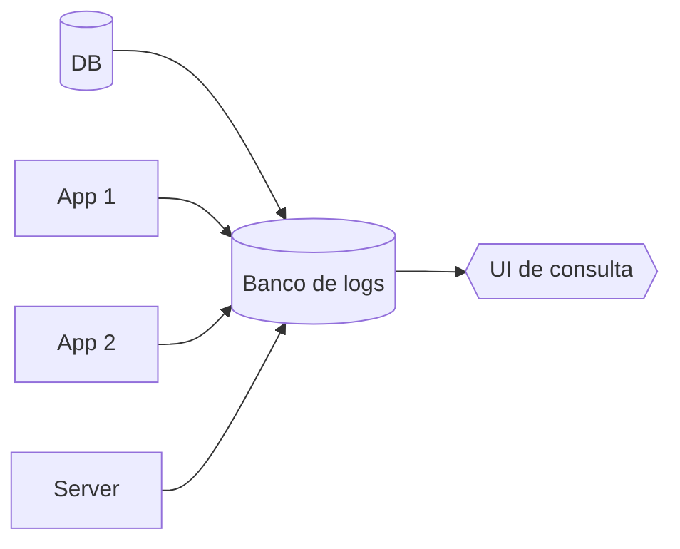
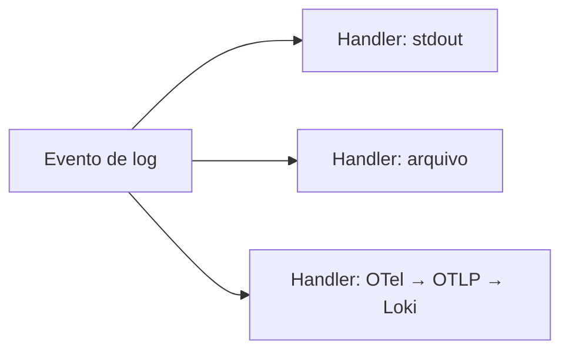
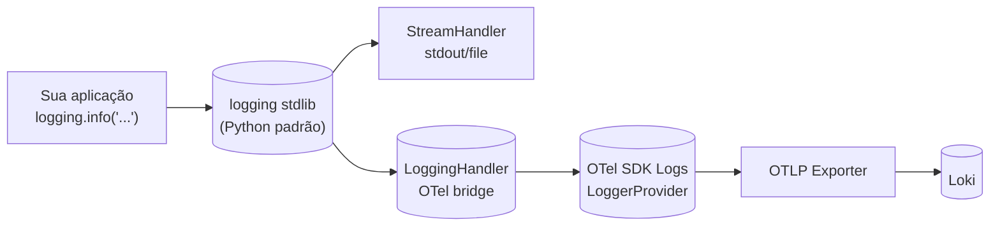
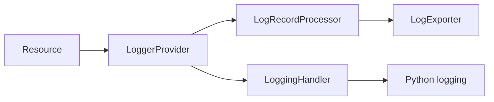

# Aula 4 — Logs com OpenTelemetry e Loki

> Apostila construída a partir da **Live de Python #266 — "Logs e observabilidade"**, do Eduardo Mendes (Dunossauro). Reinterpretação didática autoral. Crédito completo no README do repositório.

---

## 1. Onde paramos, onde chegamos

Aulas 2 e 3 deram à nossa aplicação dois superpoderes:

- **Métricas** respondem **"quanto?"** — quantas requisições, quanta latência agregada, quanto consumo.
- **Traces** respondem **"para onde?"** — onde *aquela* requisição específica passou e onde gastou tempo.

Falta o terceiro pilar, o que toda aplicação Python já gera desde sempre: **logs**. Eles respondem a pergunta complementar — **"o que aconteceu, em texto livre?"**. A genialidade da aula 4 é amarrar os logs aos traces que já temos, para que, a partir de um trace problemático, você consiga abrir os logs *daquela* requisição específica — e vice-versa.

No final, vamos abrir um trace lento no Tempo, clicar em "Logs for this span", e ver as linhas de log emitidas exatamente durante aquela requisição. Esse é o momento "eureka" da aula.

O roteiro segue exatamente o do Dunossauro:

1. **O que são logs e quais seus tipos.** Vocabulário.
2. **Logs e OTel.** Por que o sinal de logs é estranhamente "diferente" dos outros — e como o conceito de *bridge* resolve isso.
3. **Instrumentação manual.** No spam, com bridge entre `logging` stdlib e OTel.
4. **Instrumentação automática.** No eggs, com `opentelemetry-instrumentation-logging` + variáveis de ambiente.

---

## 2. Um grande aviso antes de começar

O próprio Dunossauro abre a live com esse aviso, e repete no meio. Vale repetir aqui:

> **A especificação do OTel marca o sinal de logs como "Stable", mas o pacote Python ainda mantém os imports prefixados com `_` (underscore) por compatibilidade histórica.**

Você vai ver coisas como `from opentelemetry._logs import set_logger_provider` e pode achar estranho — afinal, módulos com `_` no Python convencionalmente são "internos, não use". Mas no caso do OTel Python para logs, essa é a **API oficial**, só que o nome ainda não foi promovido. Quando isso mudar (e provavelmente vai), basta um find-and-replace nos imports — o restante da API permanece estável.

Status atual (confirmado em [opentelemetry.io/docs/languages/python](https://opentelemetry.io/docs/languages/python/)):

| Sinal | API | SDK | Pacote Python |
|---|---|---|---|
| Traces | Stable | Stable | `opentelemetry.trace`, `opentelemetry.sdk.trace` |
| Métricas | Stable | Stable | `opentelemetry.metrics`, `opentelemetry.sdk.metrics` |
| Logs | Stable (na spec) | Stable (na spec) | `opentelemetry._logs`, `opentelemetry.sdk._logs` (ainda com `_`) |

Não é problema seu, é só inércia de versionamento. Vamos seguir.

---

## 3. Logs, do zero

### 3.1. Definição

**Logs são registros — estruturados ou não — de eventos importantes em um sistema.** Tradicionalmente vão para `stdout` ou para arquivos:

```
2026-04-15 14:32:01 INFO Tentativa de login às 14:32:01 com email pedro@empresa.com no serviço auth-api
2026-04-15 14:32:01 ERROR Conexão com banco de dados falhou: timeout após 5000ms
2026-04-15 14:32:02 INFO Pagamento aprovado para pedido_id=4287, valor_brl=89.90
```

### 3.2. Tipos de logs

O Dunossauro categoriza assim:

| Tipo | Para que serve | Exemplos |
|---|---|---|
| **Eventos** | Entender como o sistema opera | Algum erro? Chamada estranha? Código que não deveria ser executado, foi? |
| **Sistema** | Eventos do SO | Memória, disco, swap, kernel panics |
| **Acesso** | Quem solicitou o quê | Acessos a recursos, problemas de permissão |
| **Servidor** | Eventos do servidor web | Requisições, IPs, timestamps |
| **Alterações** | Mudanças de configuração | Versão do serviço, env vars alteradas, scaling |

Nem todo log precisa entrar nessa taxonomia rígida — o ponto é entender que log "não é só erro": é qualquer linha de história que você queira contar sobre o que aconteceu no sistema.

### 3.3. O problema: logs descentralizados

Sem disciplina, cada componente cospe logs no seu próprio lugar:



Quando dá problema às 3 da manhã, você abre 4 SSHs, faz `tail -f` em 4 arquivos, e tenta correlacionar timestamps manualmente. Não escala.

### 3.4. A proposta: logs centralizados



É o que ferramentas tipo **Loki**, ELK (Elasticsearch + Logstash + Kibana), Graylog ou plataformas SaaS (Datadog Logs, NewRelic) fazem: agregam logs de várias origens em um único banco indexado, com UI de busca.

Na nossa stack, **Loki** já está dentro do container `grafana/otel-lgtm` que usamos desde a aula 2. É o L do LGTM. Não vai precisar instalar nada novo.

### 3.5. Conceitos importantes do `logging` Python

Como na aula a integração se dá através do `logging` padrão do Python, vale revisar três conceitos rápidos:

**Níveis (severity)** — `DEBUG < INFO < WARNING < ERROR < CRITICAL`. Cada record tem um nível, e cada handler pode filtrar por nível.

**Handlers** — rotinas associadas a eventos de log. Padrão: `StreamHandler` (terminal), `FileHandler` (arquivo), `SysLogHandler` (syslog). **A grande sacada da aula:** o OTel oferece um handler próprio que envia para OTLP.

**Propagação** — loggers são organizados em árvore (`spam.api.combo` propaga para `spam.api` que propaga para `spam` que propaga para `root`). Adicionar um handler no `root` faz toda a aplicação herdar.



### 3.6. Estruturação: o problema, e por que importa

O `logging` padrão produz texto bruto:

```
2026-04-15 14:32:01 INFO Tentativa de login com email pedro@empresa.com no serviço auth-api
```

Para buscar "todos os logins de pedro@empresa.com" você precisa de regex em texto. Funciona, mas é frágil — qualquer mudança no formato quebra a busca.

A alternativa: **logs estruturados** (JSON), onde cada campo é uma propriedade indexável:

```json
{
  "timestamp": "2026-04-15T14:32:01Z",
  "severity": "INFO",
  "message": "Tentativa de login",
  "email": "pedro@empresa.com",
  "service": "auth-api"
}
```

Agora "todos os logins de pedro@empresa.com" é uma query estruturada — `{email="pedro@empresa.com"}`. Loki é otimizado para esse modelo.

**Boa notícia:** quando você usa o handler do OTel, seus logs viram automaticamente LogRecords estruturados — você não precisa configurar formatter de JSON.

---

## 4. Logs sob a ótica do OTel: por que é "igual, mas diferente"

Aqui está o detalhe que faz a aula 4 ser singular comparada às outras: **o OTel trata logs diferente de métricas e traces**.

### 4.1. O motivo

Para métricas e traces, **o OTel é a API que você usa diretamente**:

```python
# métricas
counter = meter.create_counter("requests")
counter.add(1)

# traces
with tracer.start_as_current_span("my_op"):
    pass
```

Para logs, isso seria um problema. Python já tem `logging` na biblioteca padrão há décadas. Quase toda lib que você usa já gera logs via stdlib. Se o OTel forçasse uma API nova, você teria que reescrever todo logger de todo lugar. **Inviável.**

A solução foi engenhosa: o OTel implementa uma **bridge** (ponte). Você continua usando `logging.getLogger().info(...)` como sempre. Por baixo, um `LoggingHandler` do OTel intercepta cada record, converte para o formato OTel (`LogRecord`), e exporta via OTLP.



Resultado: **sua aplicação não sabe que o OTel existe**. Você ganha tudo (estruturação, correlação com traces, envio centralizado) sem reescrever uma linha de logging.

### 4.2. LogRecord do OTel: o que ele contém

Cada log emitido vira um `LogRecord` com mais informação que o `logging` padrão jamais teria:

```json
{
  "body": "log emitido dentro do span",
  "severity_text": "INFO",
  "severity_number": 9,
  "timestamp": "2026-04-15T14:32:01.170518Z",
  "observed_timestamp": "2026-04-15T14:32:01.170570Z",
  "attributes": {
    "code.filepath": "/app/main.py",
    "code.function": "combo",
    "code.lineno": 127,
    "nome": "pedro"
  },
  "trace_id": "0xd4c7aec3f4ef300edffe88467e2e67fd",
  "span_id": "0xb70acfcfe9227cc2",
  "trace_flags": 1,
  "resource": {
    "service.name": "spam",
    "service.version": "0.4.0"
  }
}
```

**O detalhe que muda tudo:** `trace_id` e `span_id`. Quando o log é emitido **dentro de um span ativo** (qualquer endpoint instrumentado com tracing), o handler do OTel preenche esses campos automaticamente com o trace e span correntes.

É isso que liga os três pilares:
- mesma requisição → mesmo `trace_id` em métrica, span e log
- no Grafana, clique num span no Tempo → vê logs daquele span no Loki

### 4.3. Convenções semânticas

Igual a métricas e traces, existe uma [convenção semântica para logs](https://opentelemetry.io/docs/specs/semconv/general/logs/). Alguns nomes que valem conhecer:

| Atributo | Significado |
|---|---|
| `code.filepath`, `code.function`, `code.lineno` | Localização no código (a auto-instrumentação preenche) |
| `exception.type`, `exception.message`, `exception.stacktrace` | Detalhes de exceção (preenchidos automaticamente em `logger.exception()`) |
| `http.request.method`, `http.response.status_code` | Para logs de acesso |
| `service.name`, `service.version` | Vem do Resource (compartilhado com métricas e traces) |

---

## 5. Instrumentação manual (no spam)

O paralelo com as outras aulas é direto:



| Componente | Papel |
|---|---|
| **Resource** | Idêntico ao das aulas 2 e 3 — identifica o serviço |
| **LoggerProvider** | Análogo a MeterProvider/TracerProvider |
| **LogRecordProcessor** | Idêntico em comportamento ao SpanProcessor: Batch para produção, Simple para debug |
| **LogExporter** | OTLP gRPC para o LGTM, ou Console para debug |
| **LoggingHandler** | **A peça nova**: integra o pipeline OTel com o `logging` stdlib do Python |

### 5.1. Em código

Esqueleto mínimo (versão simplificada do que está em `spam/app/logging_otel.py`):

```python
import logging
from opentelemetry._logs import set_logger_provider
from opentelemetry.sdk._logs import LoggerProvider, LoggingHandler
from opentelemetry.sdk._logs.export import BatchLogRecordProcessor
from opentelemetry.exporter.otlp.proto.grpc._log_exporter import OTLPLogExporter
from opentelemetry.sdk.resources import SERVICE_NAME, Resource

# 1. Resource
resource = Resource.create({SERVICE_NAME: "spam"})

# 2. Provider
provider = LoggerProvider(resource=resource)
set_logger_provider(provider)

# 3+4. Processor + Exporter (Batch, igual à aula 3)
provider.add_log_record_processor(
    BatchLogRecordProcessor(OTLPLogExporter(endpoint="http://lgtm:4317", insecure=True))
)

# 5. Handler instalado no logger raiz
handler = LoggingHandler(level=logging.INFO, logger_provider=provider)
logging.getLogger().addHandler(handler)
logging.getLogger().setLevel(logging.INFO)

# 6. A partir daqui, use logging normalmente
logger = logging.getLogger("spam")
logger.info("startup completo")  # ← vira LogRecord OTLP automaticamente
```

### 5.2. O que o spam faz com isso

Em `spam/app/main.py` da aula 4, cada endpoint relevante ganhou `logger.info(...)` em pontos-chave:

```python
@app.get("/combo/{nome}")
async def combo(nome: str):
    with tracer.start_as_current_span("spam.combo") as span:
        logger.info("combo iniciado", extra={"nome": nome})
        # ... lógica ...
        logger.info("combo concluído", extra={"nome": nome, "duracao_ms": ...})
```

Como esses `logger.info` são chamados **dentro de um span ativo**, o `LoggingHandler` do OTel preenche `trace_id` e `span_id` no LogRecord automaticamente. Não precisa fazer nada além disso.

Se houver erro:

```python
except httpx.HTTPError as erro:
    logger.error(
        "falha na chamada ao eggs",
        extra={"erro": str(erro)},
    )
```

E no Loki, esse log aparece com nível ERROR, trace_id da requisição que falhou, e o atributo `erro` com a mensagem — pronto para postmortem.

### 5.3. O detalhe do `extra=`

Você pode passar `extra={"chave": valor}` em qualquer chamada de logging. Esses pares viram **atributos** no LogRecord OTel, indexáveis no Loki. É o equivalente a "structured logging" sem precisar trocar de biblioteca.

---

## 6. Instrumentação automática (no eggs)

Para o eggs, fizemos as três mudanças mais simples possíveis:

1. **Adicionado ao `eggs/requirements.txt`**:
   ```
   opentelemetry-instrumentation-logging==0.50b0
   ```

2. **No `docker-compose.yml`**, ligado:
   ```yaml
   OTEL_LOGS_EXPORTER: otlp
   OTEL_PYTHON_LOG_CORRELATION: "true"
   OTEL_PYTHON_LOG_LEVEL: info
   ```

3. **Dockerfile inalterado** — o `opentelemetry-instrument` continua sendo o wrapper do uvicorn, e agora detecta a instrumentação de logging recém-instalada.

Por baixo, o `opentelemetry-instrument`:

- Anexa um `LoggingHandler` ao logger raiz do Python (igual ao que fizemos manualmente no spam).
- Liga o registro de fábrica do `logging` que injeta `trace_id` e `span_id` em cada record (porque `OTEL_PYTHON_LOG_CORRELATION=true`).
- Configura o exporter OTLP para enviar para o LGTM.

**Zero linhas de Python alteradas no `main.py` do eggs.** Os `logger.info(...)` que adicionamos lá usam `logging` padrão — nenhuma menção ao OTel.

Esse é o ponto culminante da auto-instrumentação: você consegue ter os três pilares (métricas + traces + logs, todos correlacionados) num serviço sem ter sequer ouvido falar do OTel — basta o operador setar variáveis de ambiente.

### 6.1. Quando manual e quando automático?

A regra é a mesma das aulas 2 e 3:

- **Automático** para o caso comum: serviço produz logs, você só quer que cheguem ao Loki estruturados e correlacionados. 90% dos casos.
- **Manual** quando você precisa customizar: múltiplos handlers (Loki + S3 + console), processors customizados (filtros, redação de PII), formatters próprios, ou rotear logs específicos para destinos diferentes.

---

## 7. Como rodar e o que ver

### 7.1. Subindo

```bash
docker compose up --build
```

Aguarde o `lgtm` ficar `healthy`.

### 7.2. Gerando logs

```bash
# bash
for i in {1..15}; do
  curl -s http://localhost/combo/pedro$i > /dev/null
  curl -s http://localhost/tarefa/3 > /dev/null
done
```

```powershell
# PowerShell
1..15 | ForEach-Object {
  Invoke-WebRequest -UseBasicParsing "http://localhost/combo/pedro$_" | Out-Null
  Invoke-WebRequest -UseBasicParsing "http://localhost/tarefa/3" | Out-Null
}
```

Provoque alguns erros também:

```bash
curl http://localhost/tarefa/99    # 400 — n fora do range
docker compose stop eggs
curl http://localhost/combo/teste  # 502 — eggs caído
docker compose start eggs
```

### 7.3. Vendo no Grafana Loki

1. Abra <http://localhost:3000> (`admin`/`admin`).
2. Menu lateral → **Explore**.
3. Troque o datasource (canto superior esquerdo) para **Loki**.
4. No campo de query, comece com algo simples:
   ```
   {service_name="spam"}
   ```
5. Clique em **Run query**.

Você vai ver as linhas de log do spam, cada uma com seu `severity`, `body`, e atributos. Clique numa linha para expandir e ver `trace_id`, `span_id`, e os campos do `extra=`.

### 7.4. Queries LogQL para experimentar

LogQL é a linguagem de query do Loki, "irmã" do PromQL:

```logql
# Todos os logs do spam
{service_name="spam"}

# Só erros
{service_name="spam"} |= "ERROR"

# Por trace_id específico (substitua pelo trace_id real)
{service_name=~"spam|eggs"} |= "0xd4c7aec3f4ef300edffe88467e2e67fd"

# Logs do endpoint /combo
{service_name="spam"} |= "combo"

# Logs de erro em qualquer serviço, últimos 5min
{service_name=~".+"} |~ "ERROR|WARNING"
```

### 7.5. O momento "eureka" — navegando trace → log

Esse é o teste que prova que os três pilares estão amarrados:

1. Vá em **Explore**, datasource **Tempo**.
2. Aba **Search**, **Service Name = spam**, **Run query**.
3. Clique num trace.
4. No painel do span, role até **Logs for this span** (ou clique no botão "Logs" no canto).

O Grafana vai automaticamente abrir o Loki filtrado pelo `trace_id` daquele span. Aparecem **exatamente as linhas de log emitidas durante aquela requisição**. Se a requisição teve erro, você lê o `logger.error(...)` original com o `traceback` capturado.

**Isso é o que diferencia observabilidade decorativa de observabilidade operacional.** Postmortem em 10 segundos em vez de 2 horas.

---

## 8. Checklist de fixação

- [ ] Sei explicar o que é a "bridge" entre `logging` stdlib e OTel, e por que ela é diferente de Métricas/Traces.
- [ ] Entendo o que é um `LoggingHandler` do OTel e onde ele se encaixa no pipeline.
- [ ] Sei o que é `OTEL_PYTHON_LOG_CORRELATION=true` e o que ele garante.
- [ ] Consigo emitir um log estruturado com `extra={...}` e ver os campos virarem atributos no Loki.
- [ ] Sei usar LogQL para filtrar logs por serviço, severidade, ou trace_id específico.
- [ ] Naveguei do Tempo (trace) para o Loki (logs daquela requisição) usando os botões do Grafana.

---

## 9. O que vem na próxima aula

Aula 5 — **Logfire como alternativa gerenciada**. Vamos comparar tudo o que construímos manualmente com uma plataforma proprietária da Pydantic que abstrai grande parte desse setup. Spoiler: cada abordagem tem seu lugar, e saber comparar é parte importante da maturidade técnica.

---

## 10. Referências

- **Live original**: Eduardo Mendes (Dunossauro) — "Logs e observabilidade", Live de Python #266.
- **Código do Dunossauro**: <https://github.com/dunossauro/live-de-python/tree/main/codigo/Live266>
- **OpenTelemetry — Logs concept**: <https://opentelemetry.io/docs/concepts/signals/logs/>
- **OpenTelemetry — Logs API spec**: <https://opentelemetry.io/docs/specs/otel/logs/api/>
- **Semantic Conventions (logs)**: <https://opentelemetry.io/docs/specs/semconv/general/logs/>
- **`opentelemetry-instrumentation-logging`**: <https://opentelemetry-python-contrib.readthedocs.io/en/latest/instrumentation/logging/logging.html>
- **Grafana Loki**: <https://grafana.com/docs/loki/latest/>
- **LogQL**: <https://grafana.com/docs/loki/latest/query/>
- **Python `logging` HOWTO**: <https://docs.python.org/3/howto/logging.html>
